## DESCRIPCIÓN GENERAL DE ACTIVIDADES

Integración de recursos web para Unidades de Apoyo para el Aprendizaje, asignaturas optativas y obligatorias a distancia, con base en el presupuesto establecido para este fin en las Bases de Colaboración que se realizan entre la Coordinación de Universidad Abierta y Educación Digital (CUAED) y la Facultad de Medicina del 1 de marzo al 31 de marzo de 2026.

## ACTIVIDADES REALIZADAS

### Educación continua: Cursos para médicos generales - DIPLOSUAYED

Integración del diplomado "Infección Pulmonar por *Mycobacterium Tuberculosis* en Personas Adultas" que incluye la actualización a la nueva plataforma, desarrollo de contenido HTML para plataforma, producción audiovisual y creación de infografías.

* Desarrollo de contenido en recursos de aprendizaje en HTML y CSS en plataforma Moodle almacenadas en repositorio GitHub. (5 recursos de aprendizaje)
* Adaptación de recursos del Catálogo CUAED con cambios y adapatación en diseño y código (17 recursos).
* Generación y diseño de tablas responsivas (18 tablas).
* Creación de infografías HTML responsivas con ilustraciones (1 infografía).
* Integración de actividades tipo examen y tareas Moodle (7 actividades).
* Integración de recurso de autoevaluación con retroalimentación personalizada (1 recurso).
* Producción gráfica que incluye:
  * Edición html de portada de la unidad del diplomado
  * Adaptación de los objetivos de aprendizaje y los temas de la unidad a formato HTML para su integración en plataforma.

Cambios y correcciones en contenido del diplomado "Infección Pulmonar por *Mycobacterium Tuberculosis* en Personas Adultas".

* Corrección de errores ortográficos y gramaticales así como de estilos en contenido HTML.
* Adición de contenido HTML para mejorar la comprensión de los recursos y las actividades Moodle.
* Ajuste en estilos CSS para su correcta visualización en dispositivos móviles.
* Creación de código CSS y optimización de código HTML.

### Ponte en line@

Correcciones y cambios en contenido de la UAPA “Contracción del Músculo Esquelético”, adecuación y edición de recursos de plataforma (CUAED) para versiones web de la UAPA.

* Cambio, actualización y adición de contenido HTML en repositorio GitHub (4)
* Ajuste en estilos CSS para su correcta visualización en dispositivos móviles.
* Creación de código CSS y optimización de código HTML para correcta visualización en dispositivos móviles.

### Libros electrónicos FundamentaleSS

Generación de contenido educativo audiovisual para el libro electrónico de la asignatura optativa a distancia "FundamentaleSS: Urgencias Médico-Quirúrgicas Vol. VI" que incluye la producción de video motion graphics y generación y edición de audio con narración con base en escaleta.

* Edición de audio con narración de voz en off y mezcla de música para video.
* Edición de video motion graphics con base en presentación de PowerPoint.
* Generación de fórmula matemática en formato LaTeX para su integración producción audiovisual.

<!-- SALTO-PAGINA -->

## PROBATORIOS

### Educación continua - Integración del diplomado "Infección Pulmonar por *Mycobacterium Tuberculosis* en Personas Adultas"

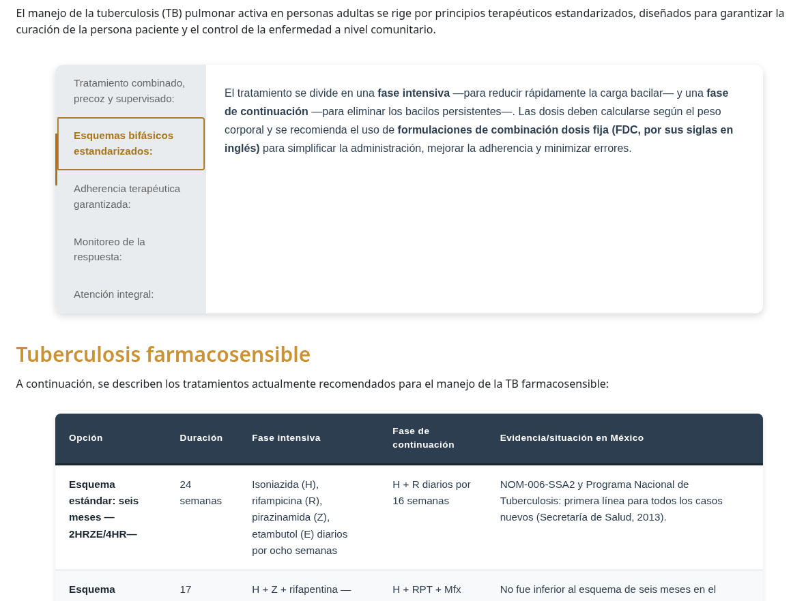
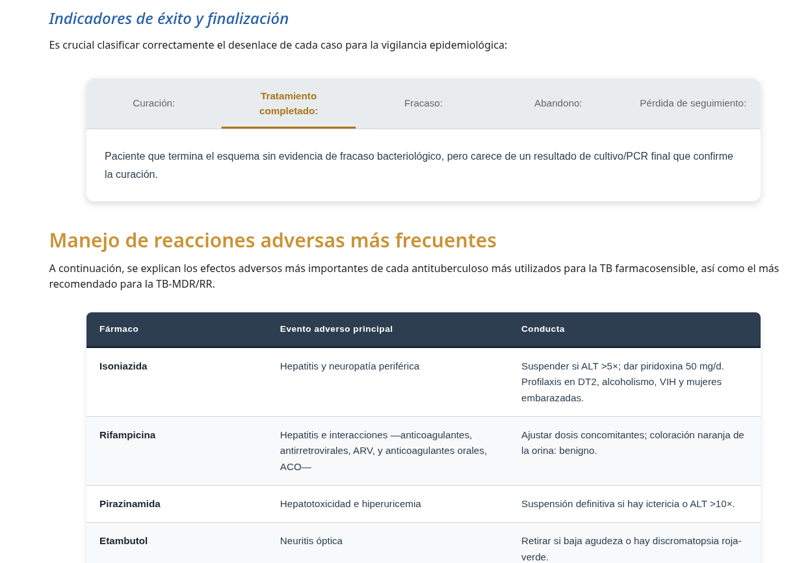
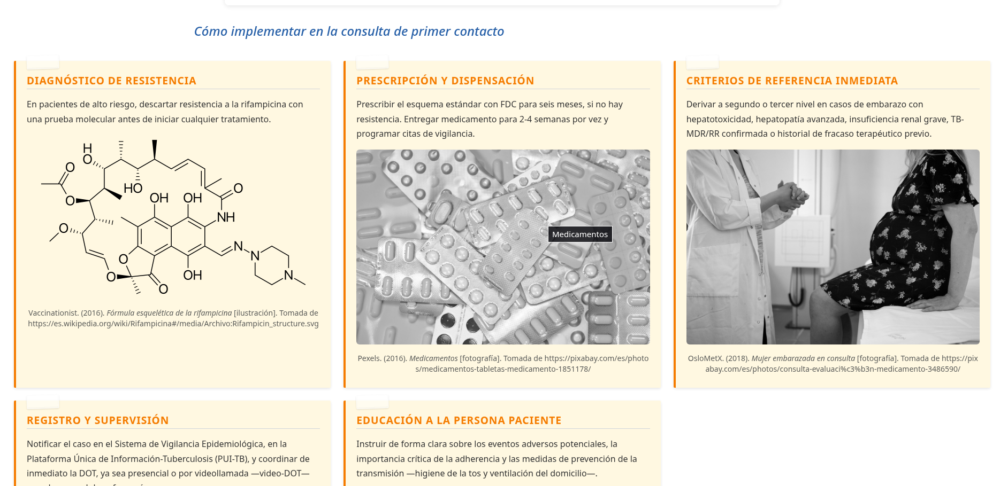
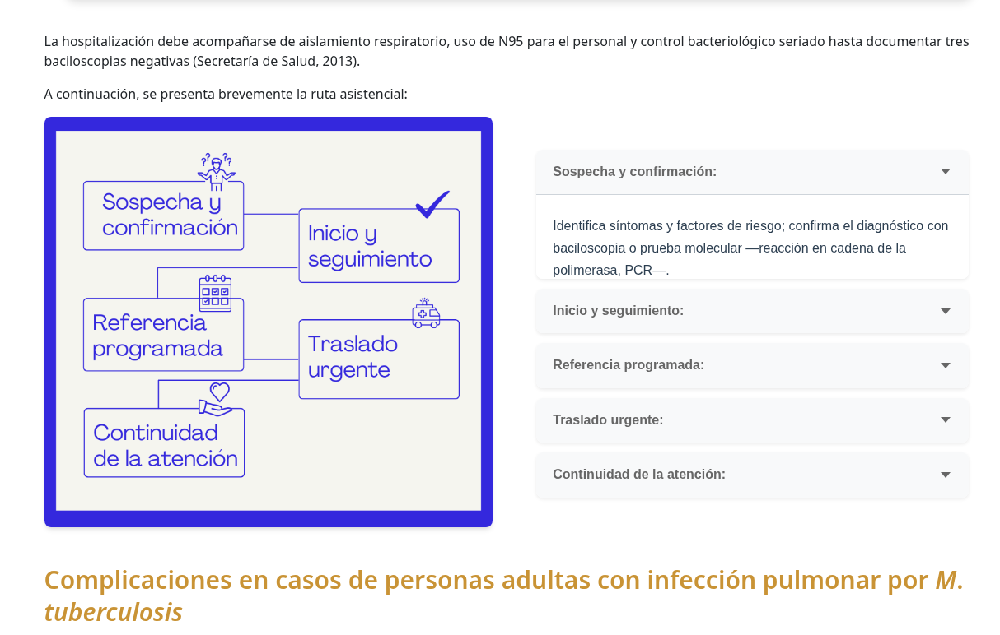

### Educación continua - Correcciones del diplomado "Infección Pulmonar por *Mycobacterium Tuberculosis* en Personas Adultas"

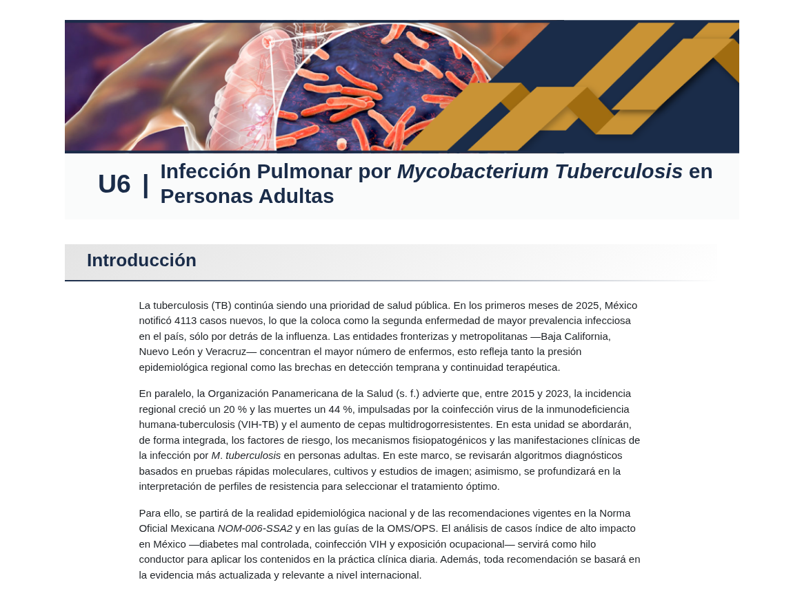
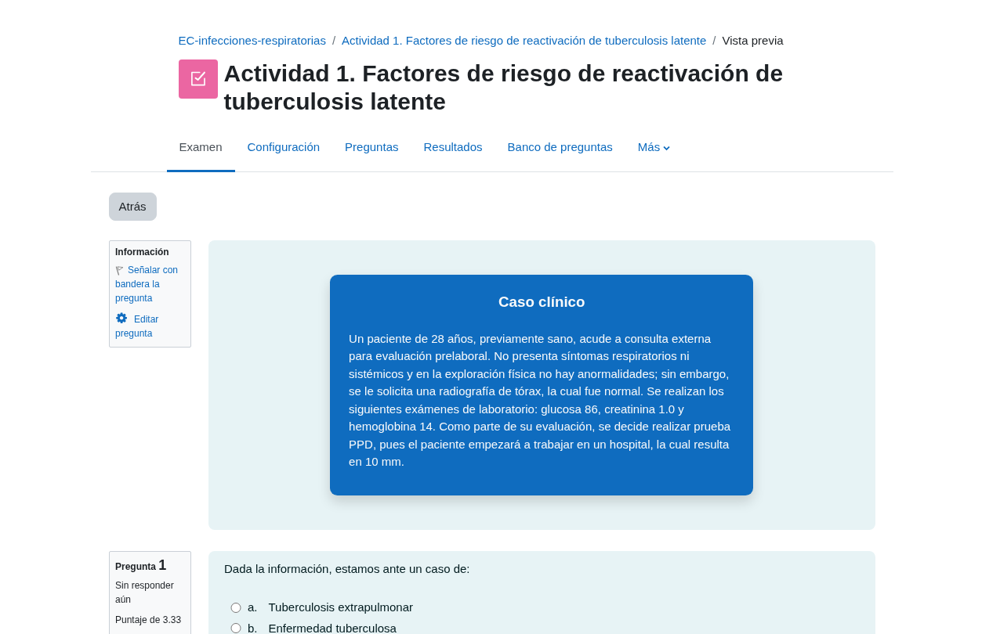
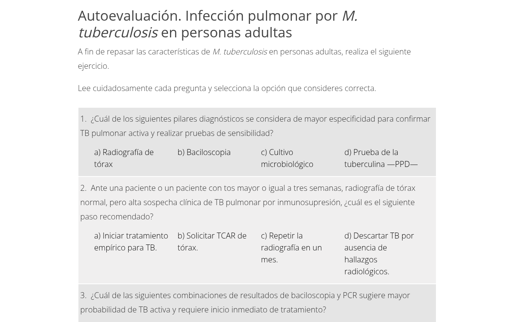
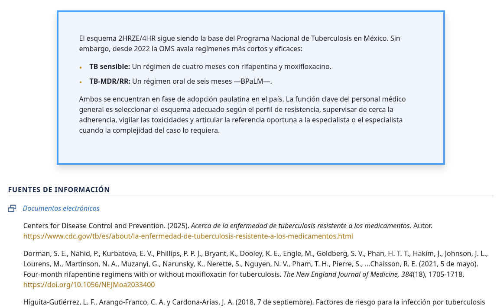

<!-- SALTO-PAGINA -->

### Ponte en línea - UAPA - Contracción del Músculo Esquelético

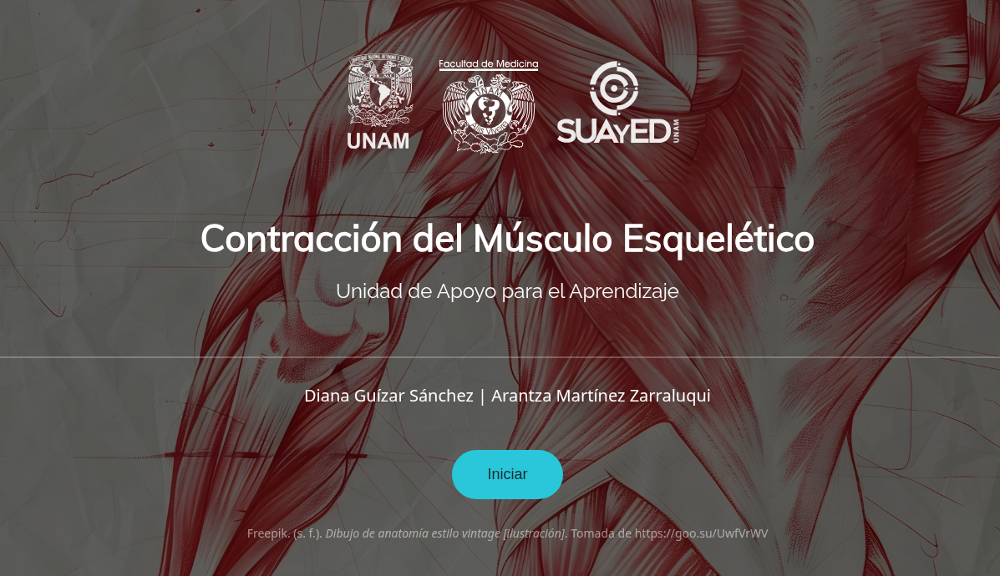
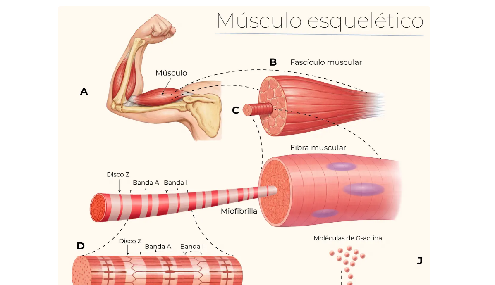
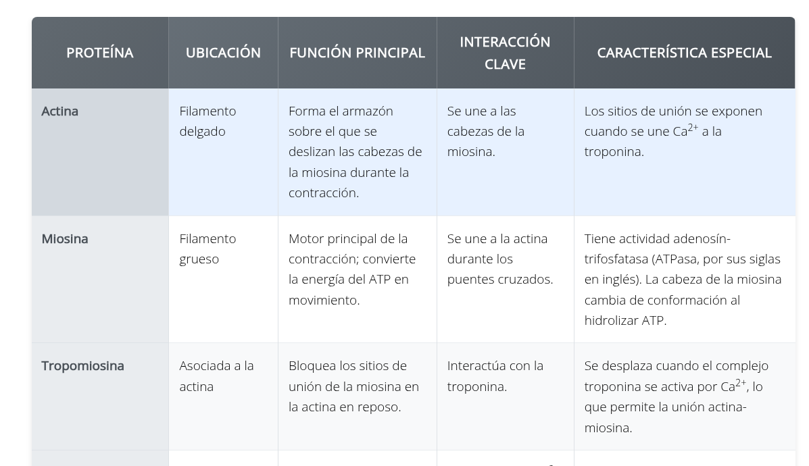
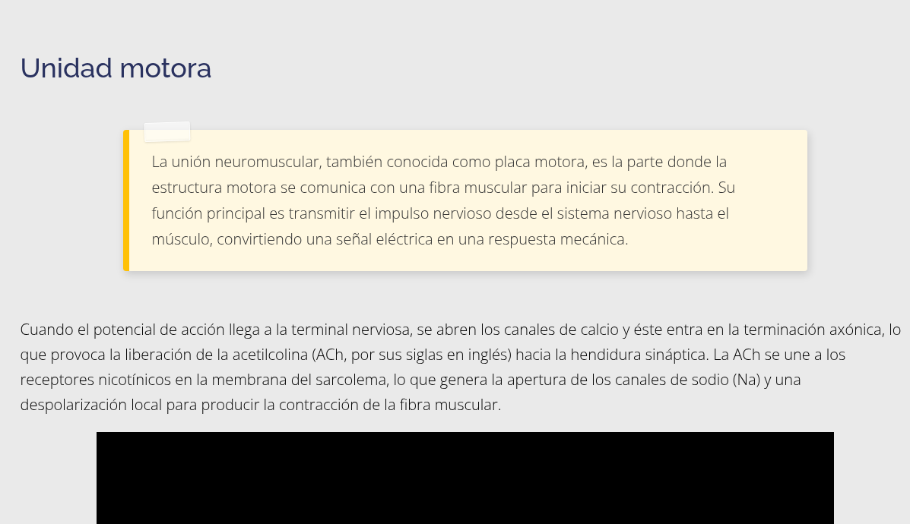
