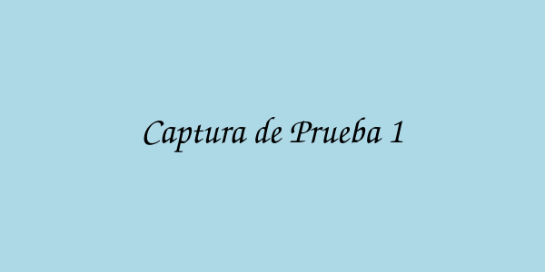

## DESCRIPCIÓN GENERAL DE ACTIVIDADES
Ejemplo de reporte mostrando cómo usar **imágenes locales** correctamente.

## ACTIVIDADES REALIZADAS

### Proyecto Demo 1
Desarrollo de componentes web.
* Actividad 1: Diseño de interfaz
* Actividad 2: Implementación de código
* Actividad 3: Pruebas de calidad

### Proyecto Demo 2
Integración de sistemas.
* Actividad 1: Análisis de requisitos
* Actividad 2: Desarrollo
* Actividad 3: Documentación

## PROBATORIOS

### Cómo usar imágenes locales

Opción 1: **Rutas relativas** (recomendado)
```markdown

```

Opción 2: **URLs externas** (siempre funcionan, requieren internet)
```markdown

```

### Ejemplos

**Imagen externa (placeholder):**


**Imagen local (ejemplo - coloca tus capturas reales en reportes/imagenes/):**


_Nota: Para que las imágenes locales funcionen, colócalas en `reportes/imagenes/` y refiérelas como se muestra arriba._
