## DESCRIPCIÓN GENERAL DE ACTIVIDADES

Integración de recursos web para Unidades de Apoyo para el Aprendizaje, asignaturas optativas y obligatorias a distancia, con base en el presupuesto establecido para este fin en las Bases de Colaboración que se realizan entre la Coordinación de Universidad Abierta y Educación Digital (CUAED) y la Facultad de Medicina del 1 de mayo al 31 de mayo de 2026.

## ACTIVIDADES REALIZADAS

### Asignaturas optativas y obligatorias-Licenciatura en Médico Cirujano

Integración de la asignatura "La Condición Humana en el Curso de Vida" que incluye la actualización a la nueva plataforma, desarrollo de contenido HTML para plataforma, producción audiovisual y creación de infografías.

* Desarrollo de contenido en recursos de aprendizaje en HTML y CSS en plataforma Moodle almacenadas en repositorio GitHub. (5 recursos de aprendizaje)
* Adaptación de recursos del Catálogo CUAED con cambios y adapatación en diseño y código (17 recursos).
* Creación de infografías HTML responsivas con ilustraciones (1 infografía).
* Integración de actividades tipo examen, foro y tareas Moodle (3 actividades).
* Integración de recurso de autoevaluación con retroalimentación personalizada (1 recurso).
* Producción gráfica que incluye:
  * Edición html de portada de la unidad del diplomado
  * Adaptación de los objetivos de aprendizaje y los temas de la unidad a formato HTML para su integración en plataforma.

<!-- SALTO-PAGINA -->

### Ponte en line@

Cambios, correcciones y contenido añadido  de la UAPA “Transporte a través de la Membrana Celular” en plataforma Moodle, adecuación y edición de recursos de plataforma (CUAED) para versiones web de la UAPA.

* Desarrollo de contenido en recursos de aprendizaje en HTML y CSS en plataforma Moodle almacenadas en repositorio GitHub.
* Ajuste personalizado de recursos del Catálogo CUAED (1 recurso).
* Desarrollo de recursos de aprendizaje en responsivo con programación de funcionalidades interactivas de acuerdo a las especificaciones contenidas en el guión instruccional. (1 recurso).
* Creación de código CSS y optimización de código HTML para correcta visualización en dispositivos móviles.

Cambios, correcciones y contenido añadido de la UAPA “Osteología”, adecuación y edición de recursos de plataforma (CUAED) para versiones web de la UAPA.

* Cambio, actualización y adición de contenido HTML en repositorio GitHub (8 cambios).
* Contenido añadido en recursos de aprendizaje en HTML y CSS en plataforma Moodle (3 recursos).
* Ajuste en estilos CSS y formato.
* Actualzización de recursos del Catálogo CUAED (6 cambios).

### Libros electrónicos FundamentaleSS

Cambios, correcciones y contenido añadido de producción audiovisual para el libro electrónico de la asignatura optativa a distancia "FundamentaleSS: Urgencias Médico Quirúrgicas Vol. VI" que incluye la producción de video motion graphics y generación y edición de audio con narración con base en escaleta.

* Edición de audio con narración de voz en off y mezcla de música para video.
* Corrección de errores ortográficos y gramaticales así como de estilos en contenido en fórumlas Latex.
* Edición de video motion graphics con base en presentación de PowerPoint.

## PROBATORIOS

### Asignaturas optativas y obligatorias-Licenciatura en Médico Cirujano - La Condición Humana en el Curso de Vida

### Ponte en line@ - UAPA Transporte a través de la Membrana Celular

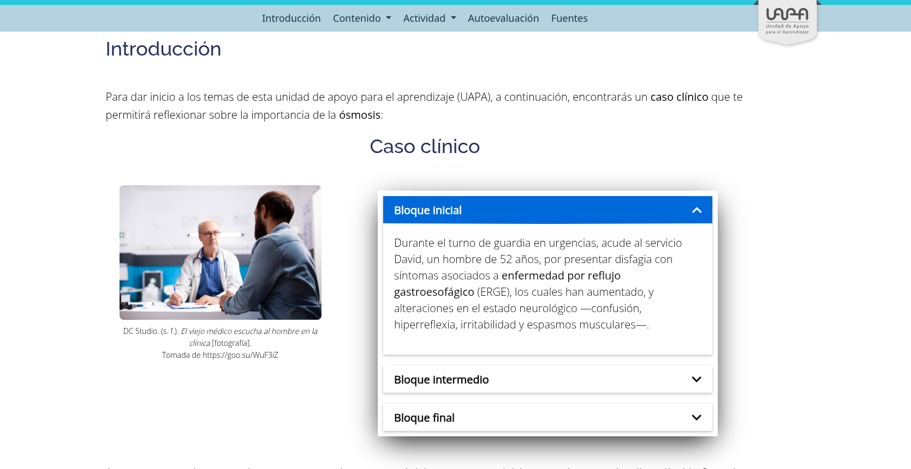
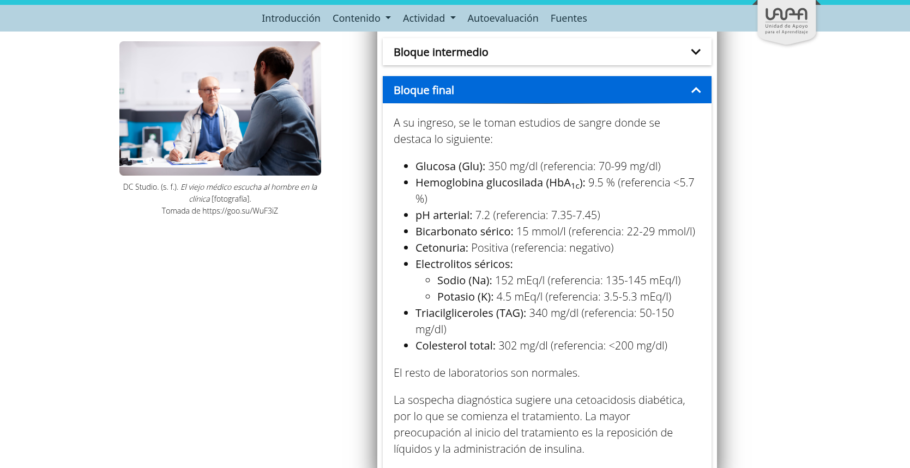
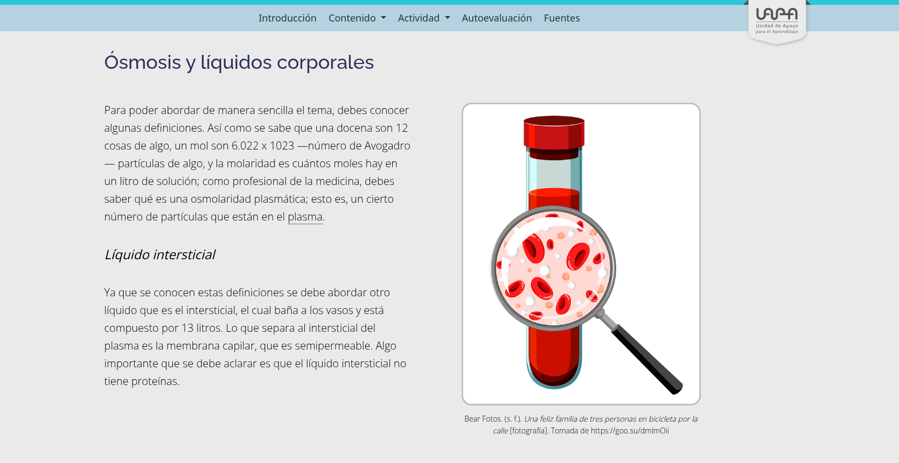
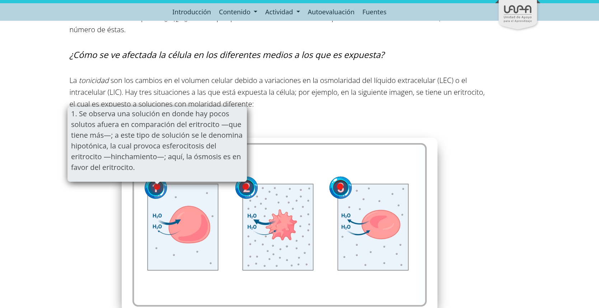

<!-- SALTO-PAGINA -->

### Ponte en line@ - UAPA “Osteología”

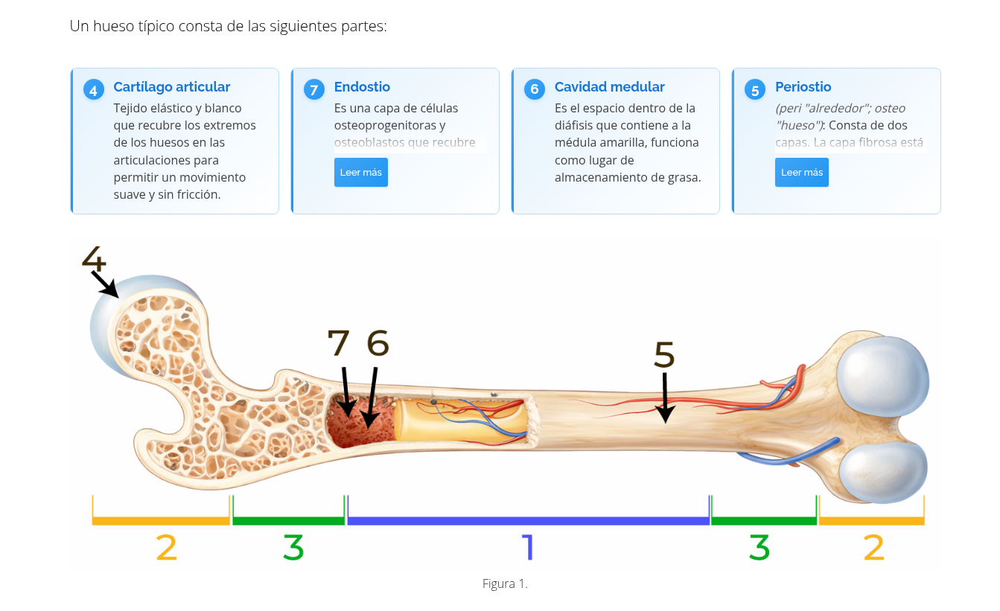

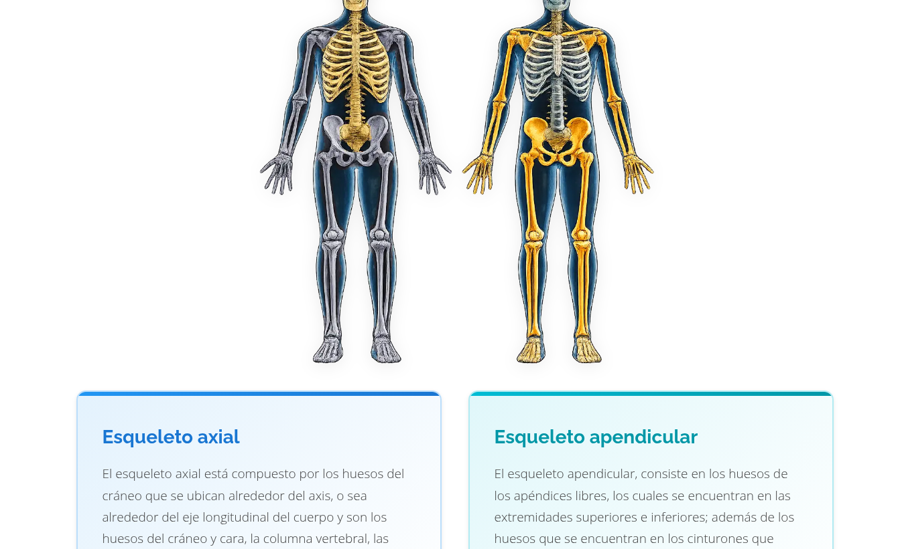
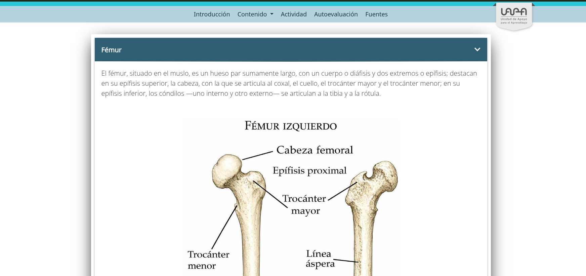
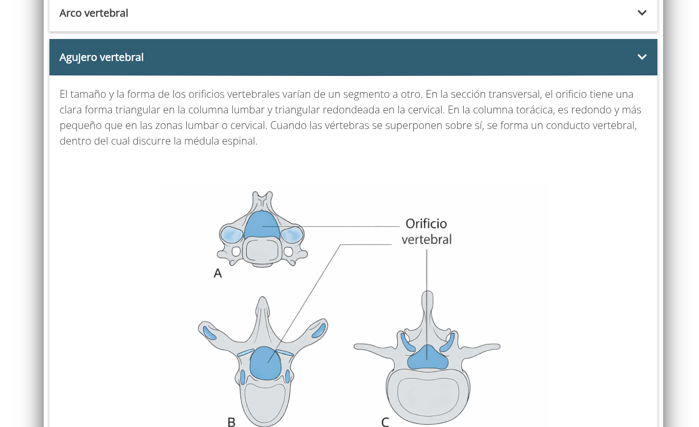
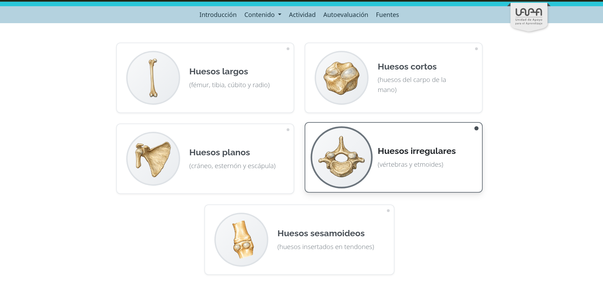
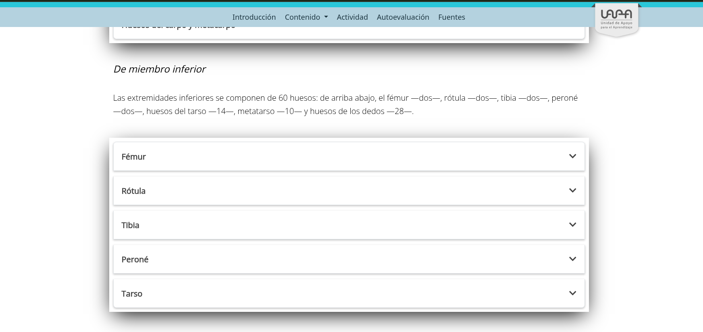
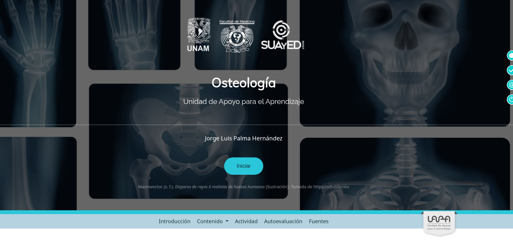

<!-- SALTO-PAGINA -->

### Libros electrónicos FundamentaleSS - Urgencias Médico Quirúrgicas Vol. VI

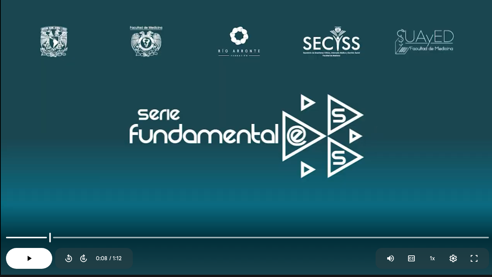
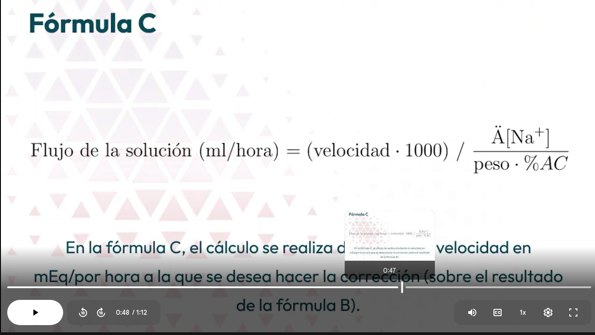
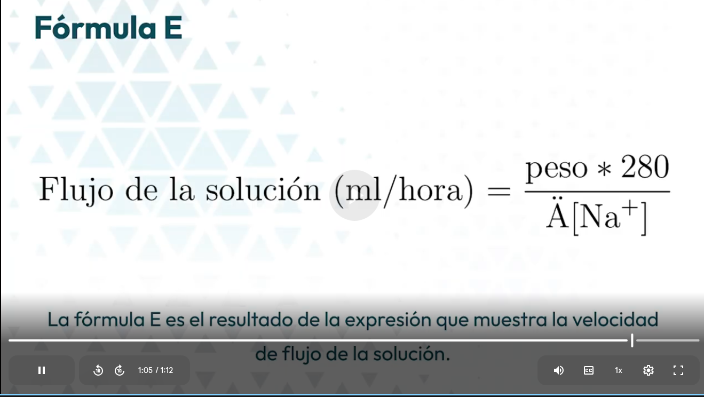
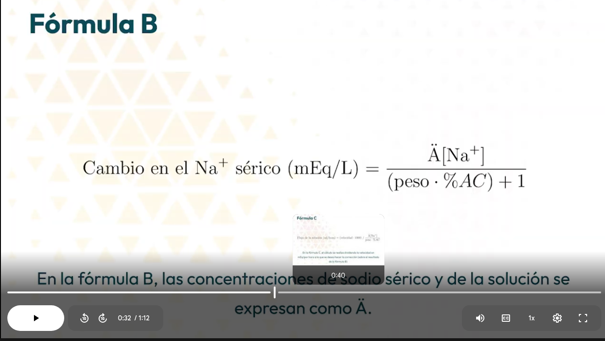
