## DESCRIPCIÓN GENERAL DE ACTIVIDADES

Integración de recursos web para Unidades de Apoyo para el Aprendizaje, asignaturas optativas y obligatorias a distancia, con base en el presupuesto establecido para este fin en las Bases de Colaboración que se realizan entre la Coordinación de Universidad Abierta y Educación Digital (CUAED) y la Facultad de Medicina del 1 de junio al 30 de junio de 2026.

## ACTIVIDADES REALIZADAS

### Asignaturas optativas y obligatorias-Licenciatura en Médico Cirujano

Cambios, correcciones y contenido añadido de la asignatura "Actualización en Infecciones Respiratorias" que incluye, desarrollo de contenido HTML para plataforma, producción audiovisual y creación o adaptación de infografías.

* Cambio, actualización y adición de contenido HTML en repositorio GitHub (16 cambios).
* Actualización de contenido en plantilla HTML y CSS para adecuarse a los nuevos lineamientos editoriales y de Web.
* Ajuste en estilos CSS y formato.

Cambios, correcciones y contenido añadido de la asignatura "La Condición Humana en el Curso de Vida" que incluye, desarrollo de contenido HTML para plataforma y producción audiovisual.

* Cambio, actualización y adición de contenido HTML en repositorio GitHub (3 cambios).
* Ajuste en estilos CSS y formato.

<!-- SALTO-PAGINA -->

### Ponte en line@

Integración de la UAPA “Funciones Secretoras del Aparato Digestivo” en plataforma Moodle, adecuación y edición de recursos de plataforma (CUAED) para versiones web de la UAPA.

* Desarrollo de contenido en recursos de aprendizaje en HTML y CSS en plataforma Moodle almacenadas en repositorio GitHub.
* Ajuste personalizado de recursos del Catálogo CUAED (11 recursos).
* Desarrollo de recursos de aprendizaje en responsivo con programación de funcionalidades interactivas de acuerdo a las especificaciones contenidas en el guión instruccional. (2 recursos).
* Creación de ilustraciones e infografías (9 ilustraciones).
* Integración de actividades de autoevaluación (3 actividades).
* Creación de código CSS y optimización de código HTML para correcta visualización en dispositivos móviles.

Cambios, correcciones y contenido añadido de la UAPA “Osteología”, adecuación y edición de recursos de plataforma (CUAED) para versiones web de la UAPA.

* Cambio, actualización y adición de contenido HTML en repositorio GitHub (27 cambios).
* Ajuste en estilos CSS y formato.

## PROBATORIOS

### Asignaturas optativas y obligatorias-Licenciatura en Médico Cirujano - Actualización en Infecciones Respiratorias

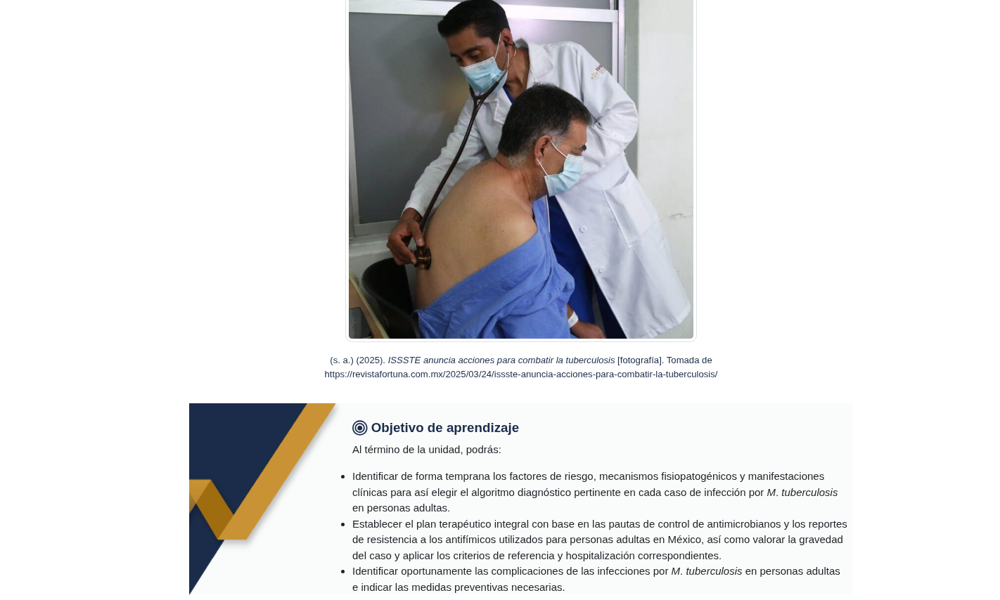
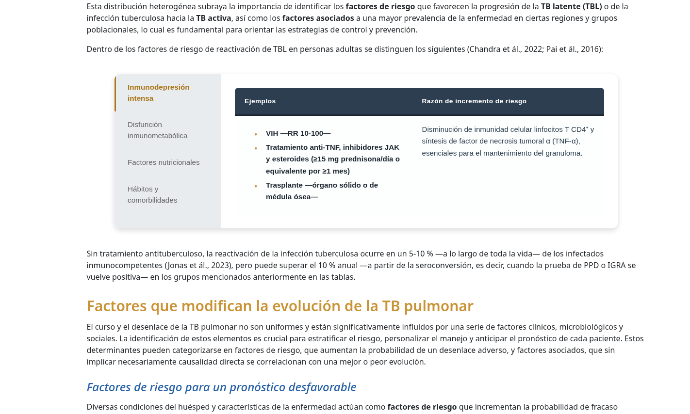
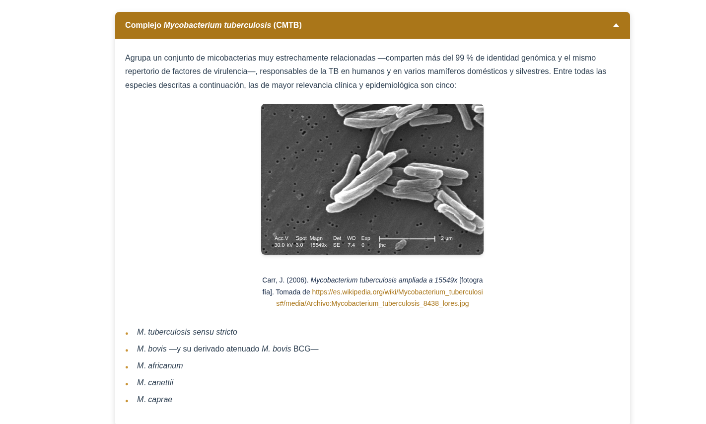
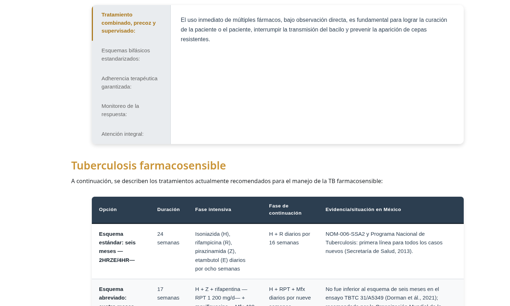

<!-- SALTO-PAGINA -->

### Asignaturas optativas y obligatorias-Licenciatura en Médico Cirujano - La Condición Humana en el Curso de Vida

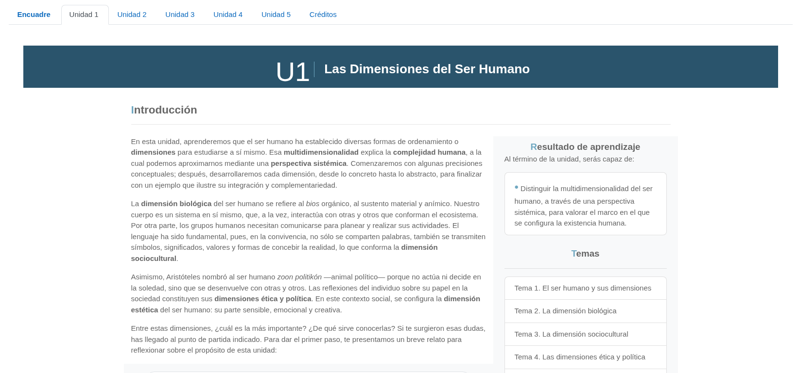
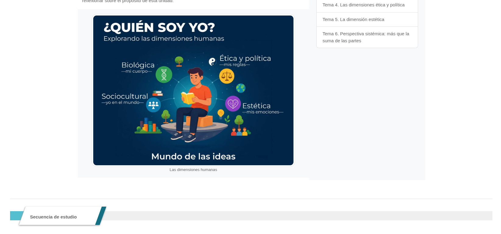
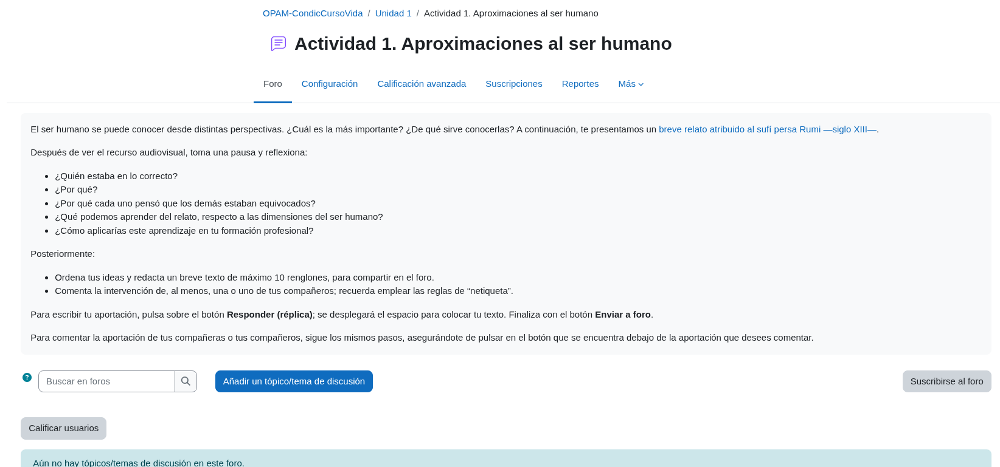

### Ponte en line@ - UAPA Funciones Secretoras del Aparato Digestivo

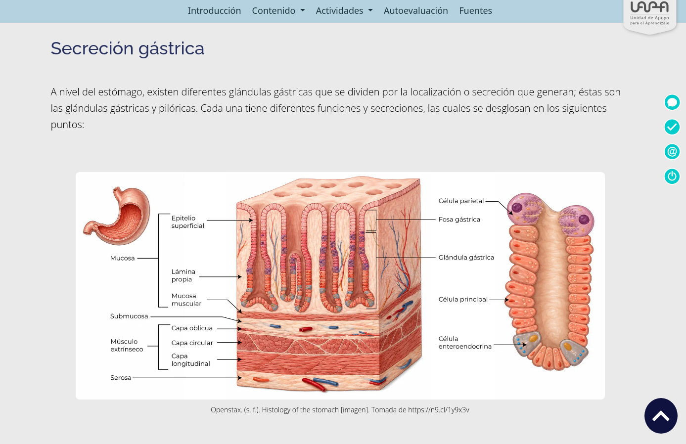
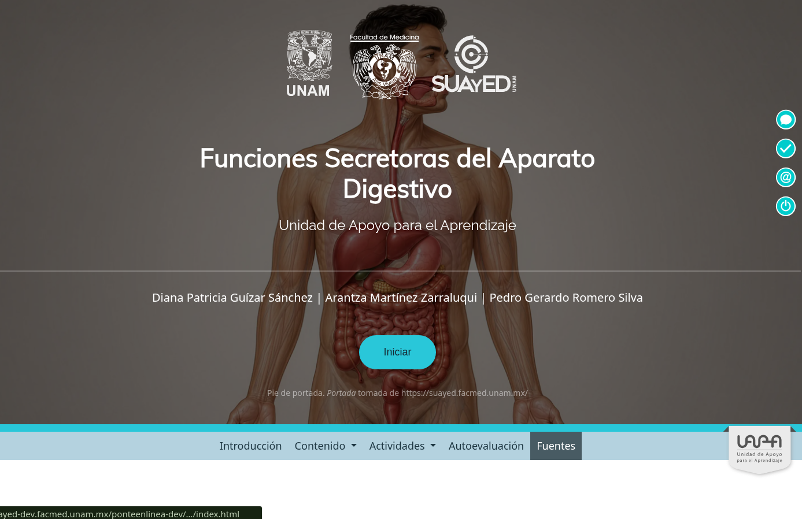
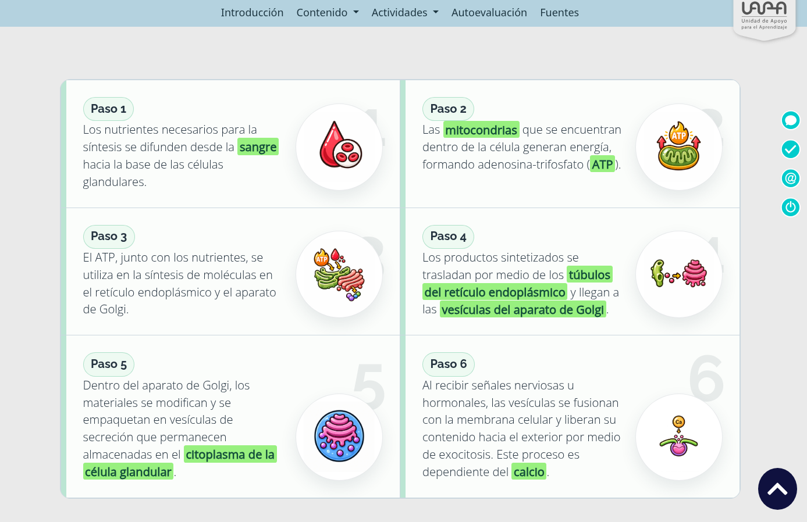
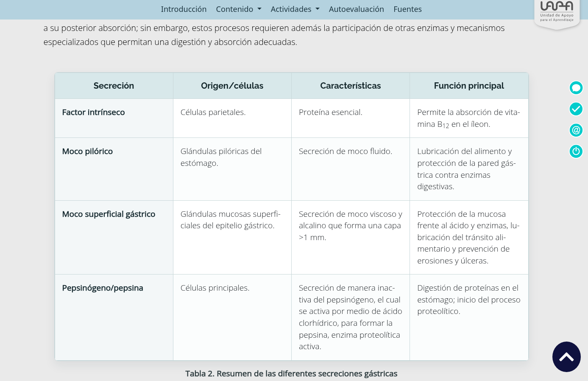

<!-- SALTO-PAGINA -->

### Ponte en line@ - UAPA “Osteología”

