## Concepto

Integración de recursos web para Unidades de Apoyo para el Aprendizaje, asignaturas optativas y obligatorias a distancia, con base en el presupuesto establecido para este fin en las Bases de Colaboración que se realizan entre la Coordinación de Universidad Abierta y Educación Digital (CUAED) y la Facultad de Medicina del 1 de julio al 31 de julio de 2026.

## ACTIVIDADES REALIZADAS

### Asignaturas optativas y obligatorias-Licenciatura en Médico Cirujano

Cambios, correcciones y contenido añadido de la asignatura "La Condición Humana en el Curso de Vida" que incluye, desarrollo de contenido HTML para plataforma y producción audiovisual.

* Cambio, actualización y adición de contenido HTML en repositorio GitHub (1 cambio).
* Ajuste en producción audiovisual.

<!-- SALTO-PAGINA -->

### Ponte en line@

Cambios, correcciones y contenido añadido de la UAPA La Síntesis como Cuarto Paso del Método Estadístico, adecuación y edición de recursos de plataforma (CUAED) para versiones web de la UAPA.

* Cambio, actualización y adición de contenido HTML en repositorio GitHub (1 cambio).
* Ajuste en producción audiovisual.

Cambios, correcciones y contenido añadido a través del uso de agentes de inteligencia artificial y scripts especificos, en la siguiente lista de UAPA: El cerebro adicto, Ciclo Biológico de Gnathostoma spp, Ciclo Biológico de Strongyloides stercoralis, Los Clásicos de la Epidemiología: Estudios Transversales, Columna Vertebral, Construcción de Plan de Vida, Enfermedades Auditivas de Origen Laboral Inducidas por Ruido, Estilo de Vida, Exploración Neurológica Básica: Estado de Alerta y Funciones Cerebrales Superiores, Fosas Extracraneales, Gluconeogénesis, Interpretación de Gráficos de Metaanálisis, Introducción a la Causalidad, Neuroanatomía del nervio trigémino, Promoción de la Salud y Prevención de la Enfermedad en Mujeres y Hombres Adultos, Técnicas de la Metodología Cualitativa, Ciclo Biológico de Toxoplasma gondii y Vigilancia Epidemiológica en México.

* *Revisión técnica general*: se revisaron 18 UAPAs en HTML, CSS, JavaScript, actividades interactivas, rutas y recursos embebidos. (18 UAPAs)
* *Correcciones responsivas*: se incorporaron reglas para adaptar imágenes, videos, tablas, iframes y contenedores, además de corregir márgenes y desbordamientos horizontales. (9 UAPAs y 11 hojas CSS nuevas)
* *Adaptación de la barra de herramientas*: se ajustó #tools para conservar botones táctiles grandes y convertirse en una barra inferior en dispositivos móviles. (9 UAPAs)
* *Corrección del footer y contenedores*: se normalizaron anchos, márgenes, paddings y floats para evitar desbordamientos y superposición con la barra móvil. (9 UAPAs)
* *Corrección de hotspots y mapas interactivos*: se reorganizaron los lienzos, marcadores y áreas táctiles para mantener su alineación con las imágenes en diferentes resoluciones. (4 UAPAs)
* *Mejoras de accesibilidad en hotspots*: se incorporaron botones reales, foco visible, áreas táctiles mínimas de 44 × 44 px, cierre mediante botón, clic exterior y tecla Esc. (2 UAPAs)
* *Mejoras en acordeones y pestañas*: se sincronizaron los estados aria-expanded, aria-hidden y aria-selected, además de agregar soporte para teclado. (3 UAPAs)
* *Corrección de carruseles*: se ajustaron las alturas dinámicas, los controles visibles, el comportamiento táctil y la adaptación de imágenes. (3 UAPAs)
* *Ajuste de iframes*: se implementó el cálculo automático de altura mediante ResizeObserver para evitar espacios vacíos y desplazamientos internos. (2 UAPAs)
* *Configuración de intentos*: se revisó el parámetro maxIntentos; se identificaron 33 configuraciones con valor 99 distribuidas en 17 UAPAs.
* *Actualización de identidad institucional*: se normalizó la denominación visible a CUAED y se eliminaron referencias activas a nombres institucionales anteriores. (18 UAPAs)
* *Limpieza y optimización de archivos*: se retiraron archivos de desarrollo, medios de demostración, mapas de código, duplicados y metadatos de macOS. También se optimizaron imágenes. (1 UAPA con limpieza documentada completamente)
* *Creación de respaldos técnicos*: se conservaron copias de seguridad de archivos sweetalert.css antes de aplicar cambios. (4 UAPAs)

<!-- SALTO-PAGINA -->

## PROBATORIOS

### Asignaturas optativas y obligatorias-Licenciatura en Médico Cirujano - La Condición Humana en el Curso de Vida

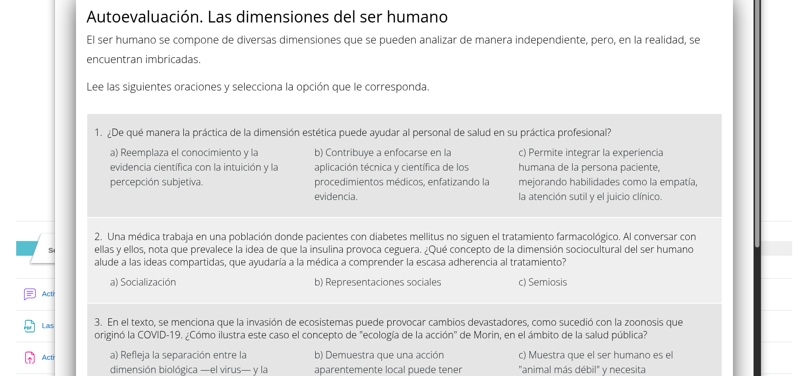

### Ponte en line@ - UAPA Cuarto Paso del Método Estadístico

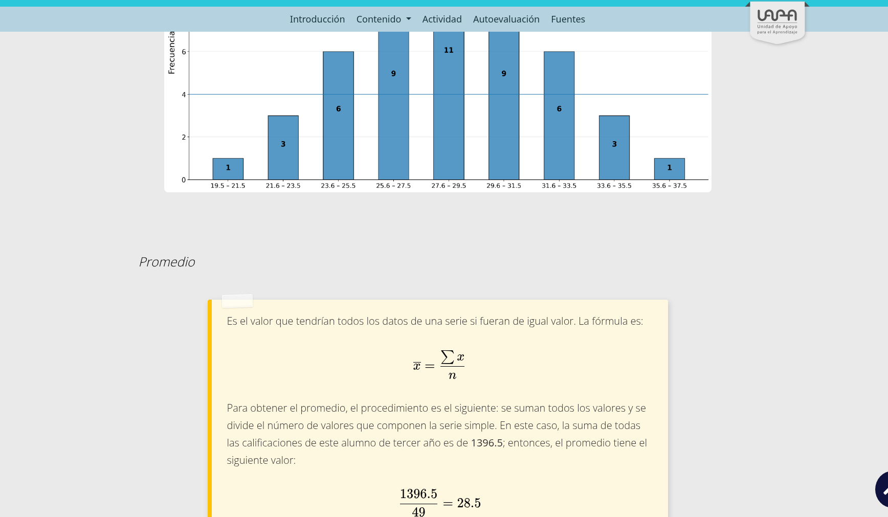

<!-- SALTO-PAGINA -->

### 
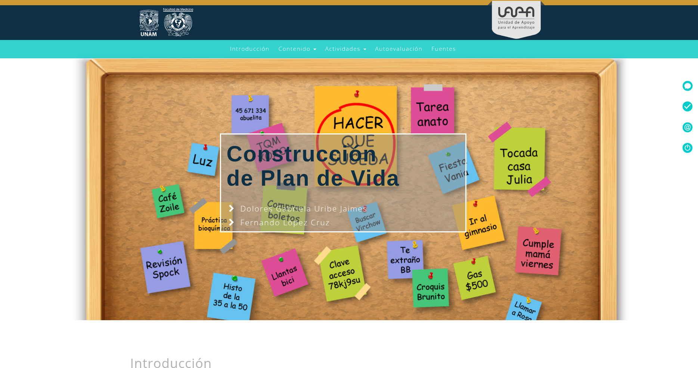
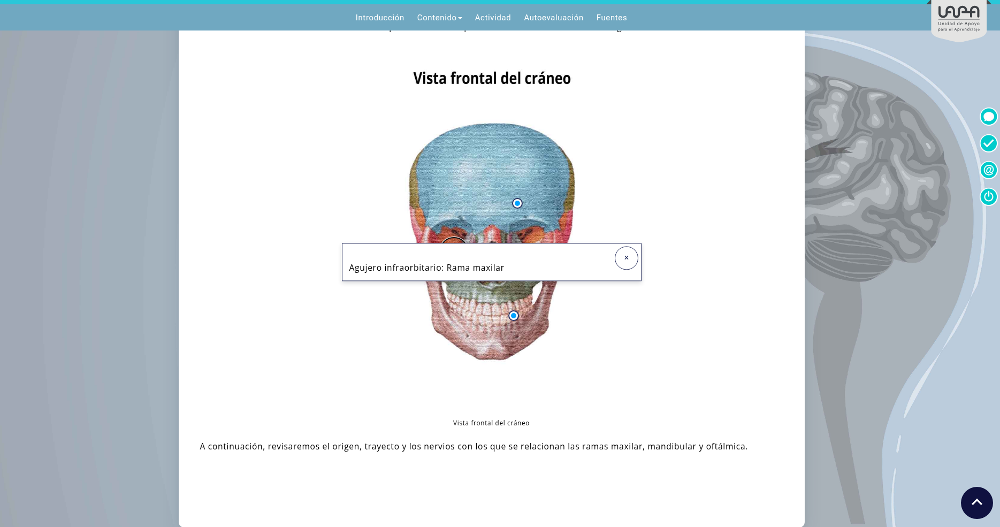
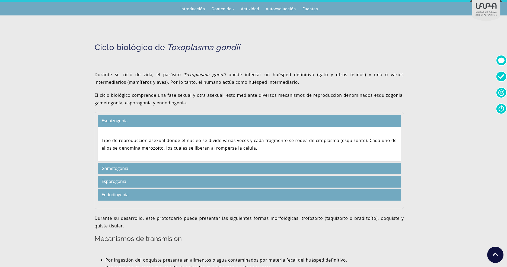
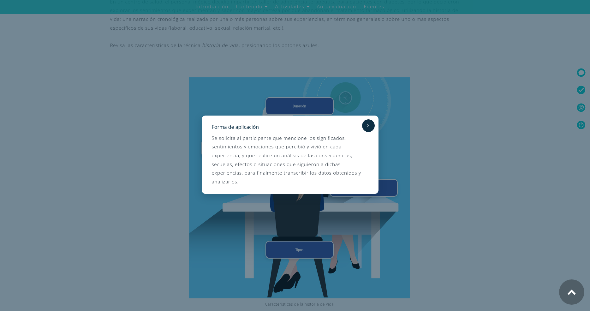
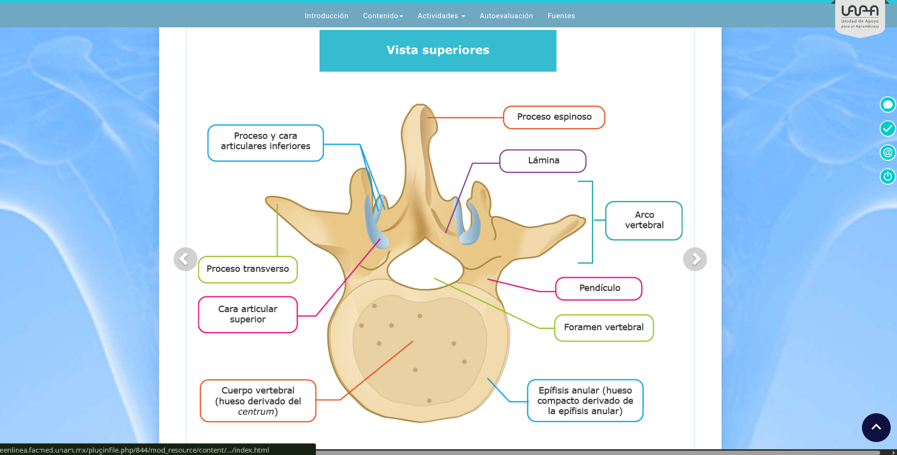
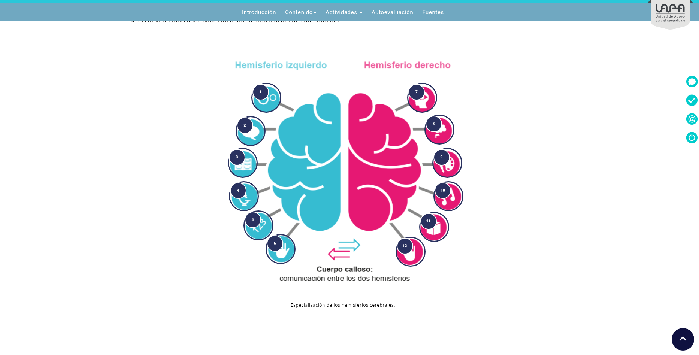
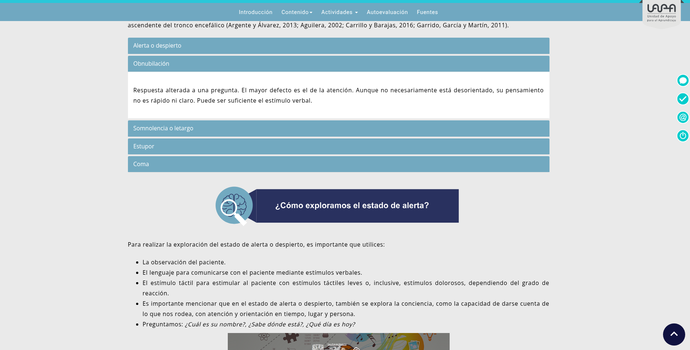
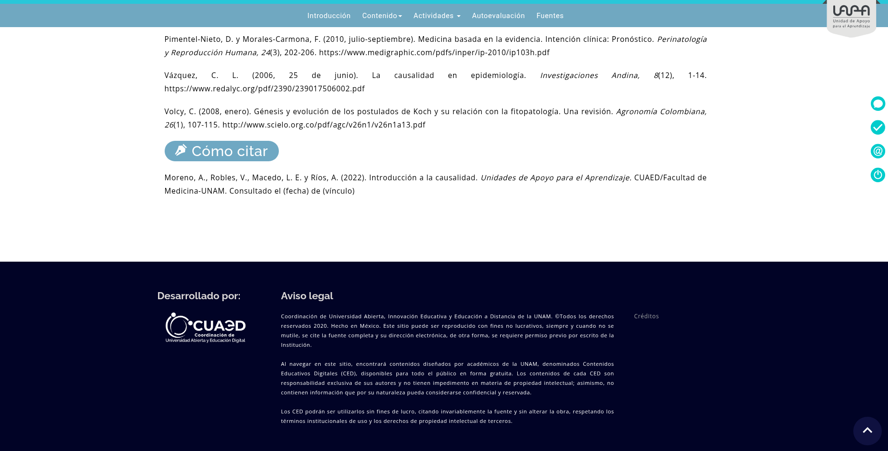

<!-- SALTO-PAGINA -->

### Ponte en line@ - 18 UAPA revisadas, corregidas y adaptadas a la plataforma web

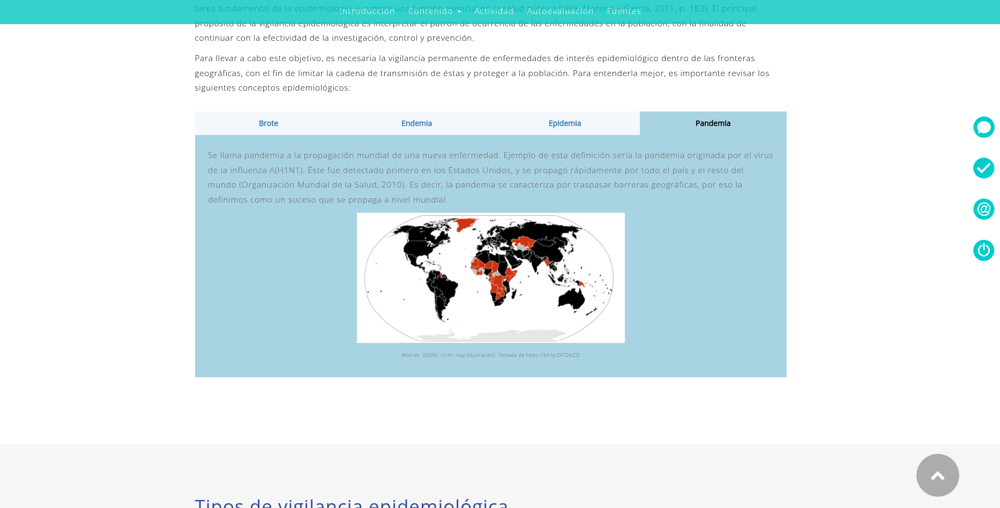
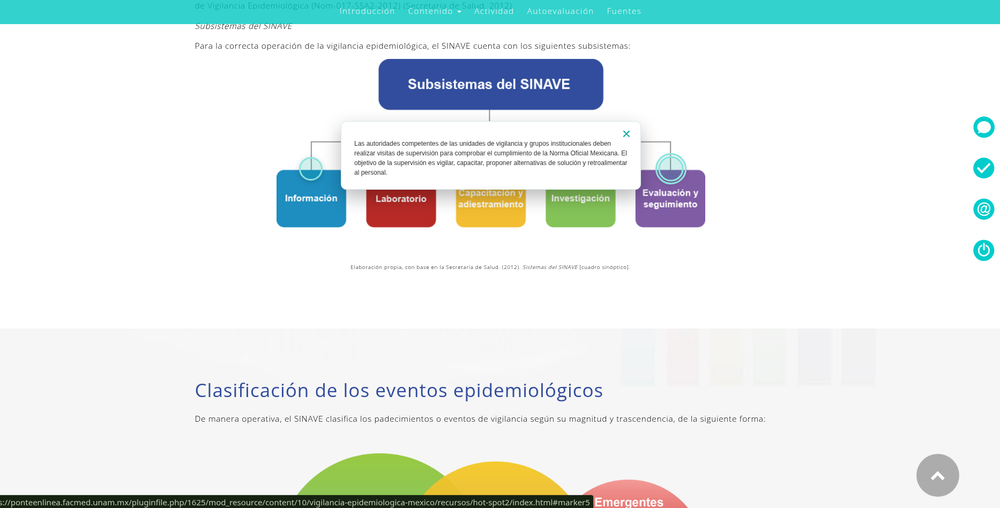
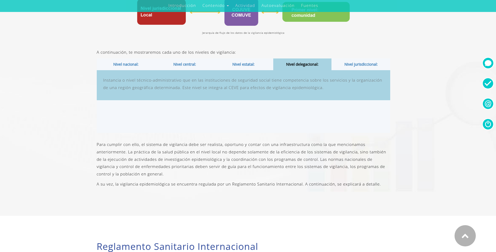
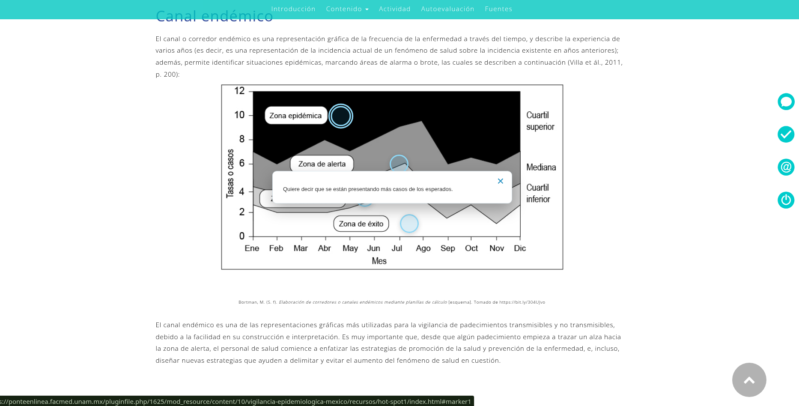
