## Concepto

Integración de recursos web para Unidades de Apoyo para el Aprendizaje, asignaturas optativas y obligatorias a distancia, con base en el presupuesto establecido para este fin en las Bases de Colaboración que se realizan entre la Coordinación de Universidad Abierta y Educación Digital (CUAED) y la Facultad de Medicina del 1 de agosto al 31 de agosto de 2026.

## ACTIVIDADES REALIZADAS

### Ponte en line@

Integración de la UAPA “Eje Hipotálamo-Hipófisis-Órgano Endocrino” con la plataforma web de la Universidad Abierta y Educación Digital (CUAED) para versiones web de la UAPA.

* Desarrollo de contenido en recursos de aprendizaje en HTML y CSS en plataforma Moodle almacenadas en repositorio GitHub.
* Ajuste personalizado de recursos del Catálogo CUAED (10 recursos).
* Desarrollo de recursos de aprendizaje en responsivo con programación de funcionalidades interactivas de acuerdo a las especificaciones contenidas en el guión instruccional. (2 recursos).
* Creación de ilustraciones e infografías (15 ilustraciones).
* Diseño de tablas y diagramas (3 tablas).
* Integración de actividades de autoevaluación (3 actividades).
* Creación de código CSS y optimización de código HTML para correcta visualización en dispositivos móviles.

<!-- SALTO-PAGINA -->

Cambios, correcciones y contenido añadido de la UAPA La Síntesis como Cuarto Paso del Método Estadístico, adecuación y edición de recursos de plataforma (CUAED) para versiones web de la UAPA.

* Cambio, actualización y adición de contenido HTML en repositorio GitHub (2 cambios).
* Corrección en datos de imágenes embebidos en UAPA. (1 imagen).
* Ajuste en producción audiovisual.

### Programa de Liderazgo e Innovación Interprofesional en Salud (PLIIS)

Integración de la unidad de aprendizaje “Innovación y Aplicación de la Tecnología ” con la plataforma web que incluye, desarrollo de contenido HTML para plataforma y producción audiovisual.

* Desarrollo de contenido en recursos de aprendizaje en HTML y CSS en plataforma Moodle almacenadas en repositorio GitHub. (1 recursos de aprendizaje)
* Adaptación de recursos del Catálogo CUAED con cambios y adapatación en diseño y código (6 recursos).
* Integración de actividades tipo examen, foro y tareas Moodle (3 actividades).
* Integración de recurso de autoevaluación con retroalimentación personalizada (1 recurso).
* Producción gráfica que incluye:
  * Edición html de portada de la unidad del diplomado
  * Adaptación de los objetivos de aprendizaje y los temas de la unidad a formato HTML para su integración en plataforma.

### Libros electrónicos FundamentaleSS

Producción audiovisual para el libro electrónico de la asignatura optativa a distancia "FundamentaleSS: Medicina Interna volumen IX" que incluye la producción de video motion graphics y generación y edición de audio con narración con base en escaleta.

* Edición de audio con narración de voz en off y mezcla de música para video.
* Edición de video motion graphics con base en presentación de PowerPoint.

## PROBATORIOS

### Ponte en line@ - UAPA Eje Hipotálamo-Hipófisis-Órgano Endocrino

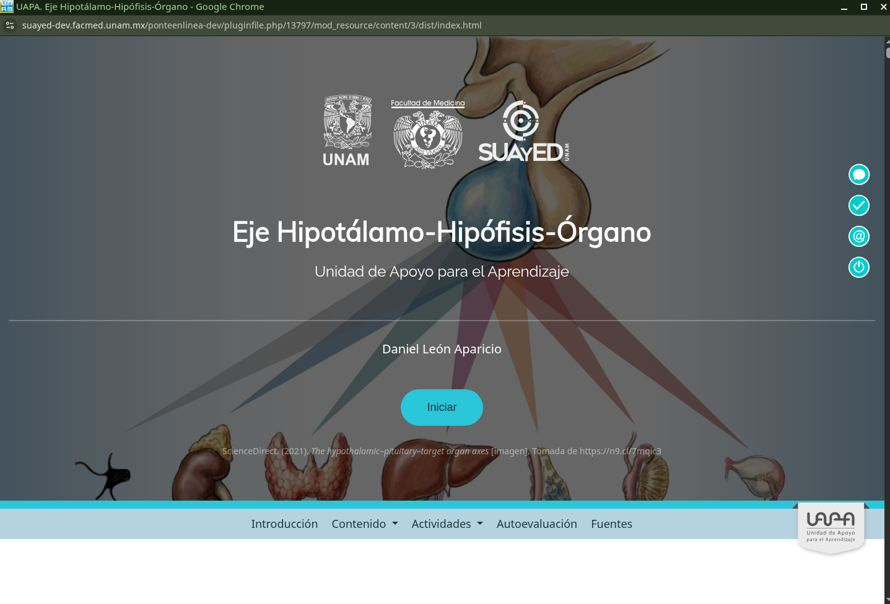

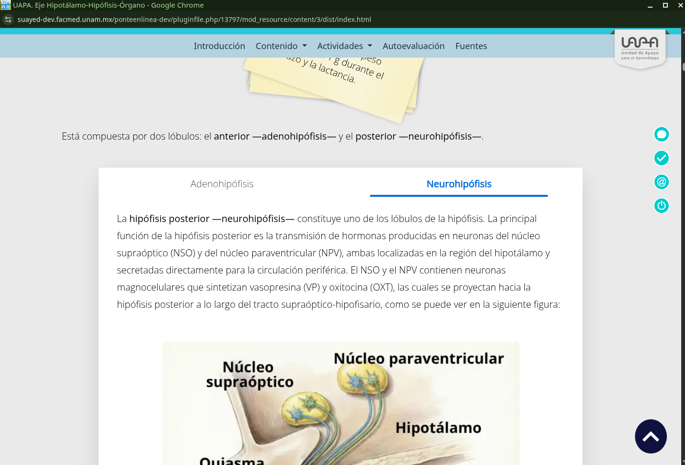
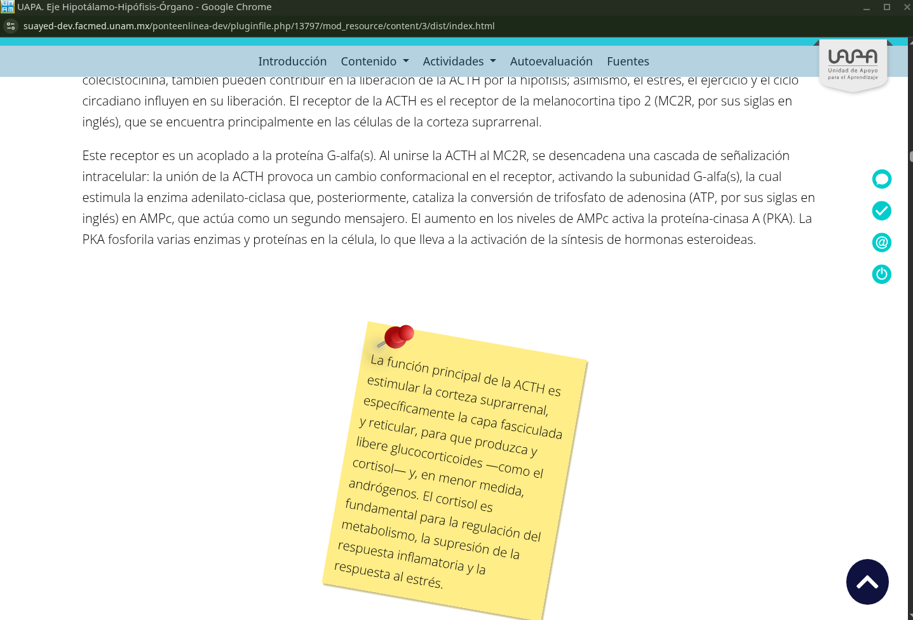
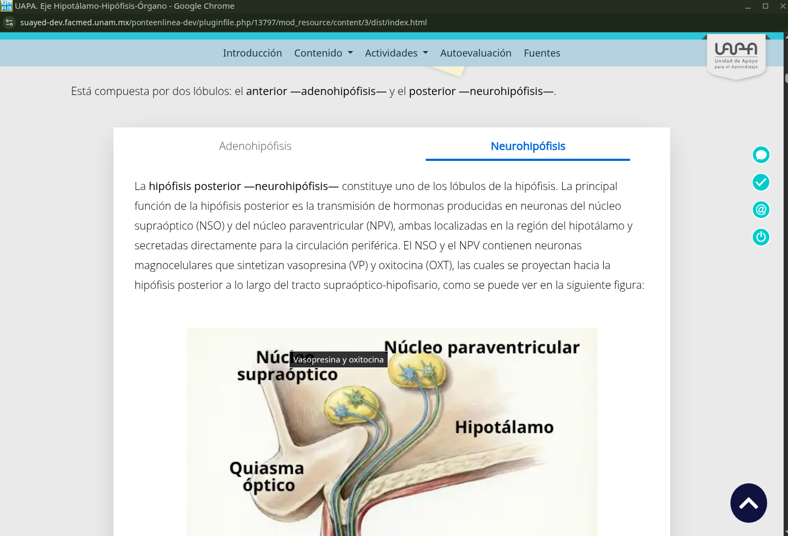
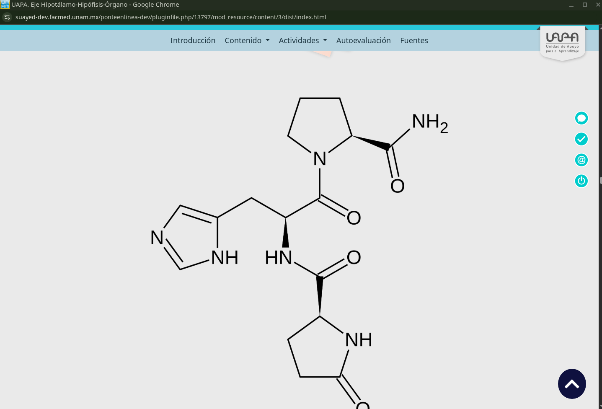

<!-- SALTO-PAGINA -->

### Ponte en line@ - UAPA La Síntesis como Cuarto Paso del Método Estadístico
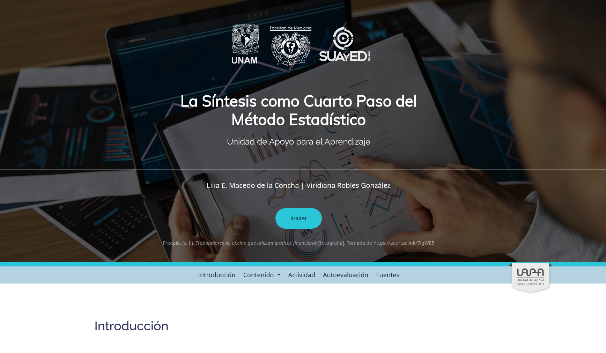
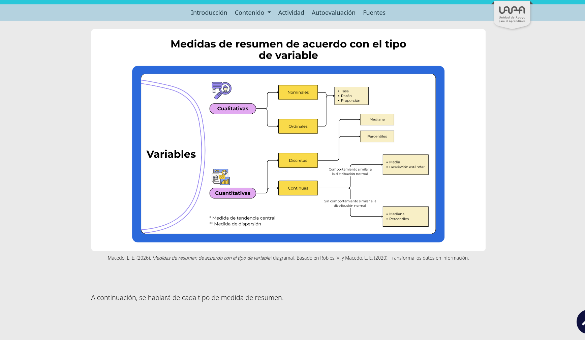

### Programa de Liderazgo e Innovación Interprofesional en Salud (PLIIS)
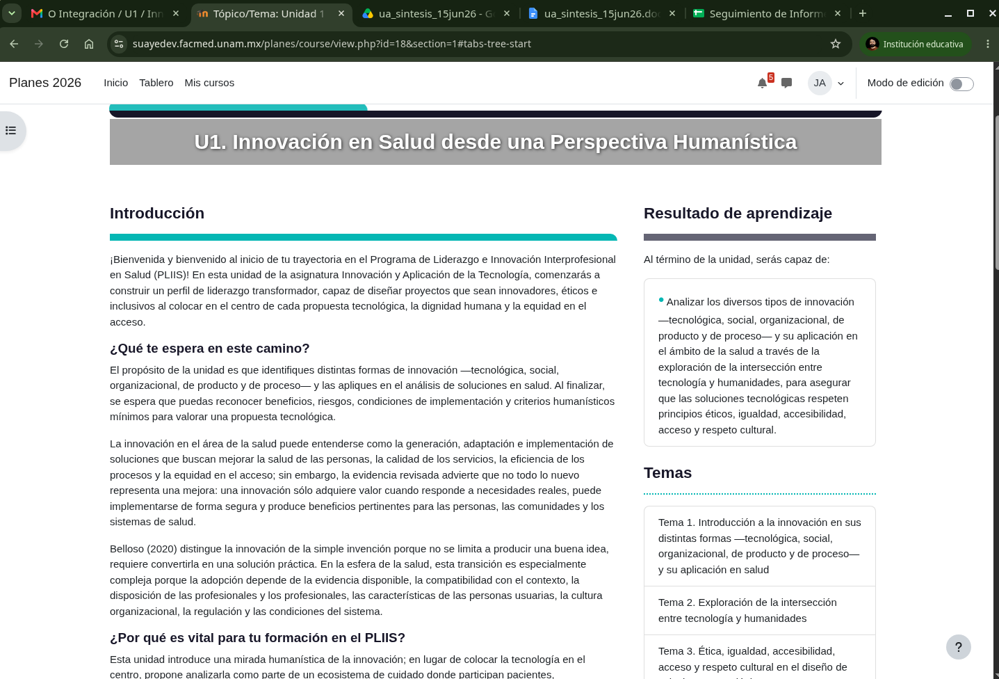

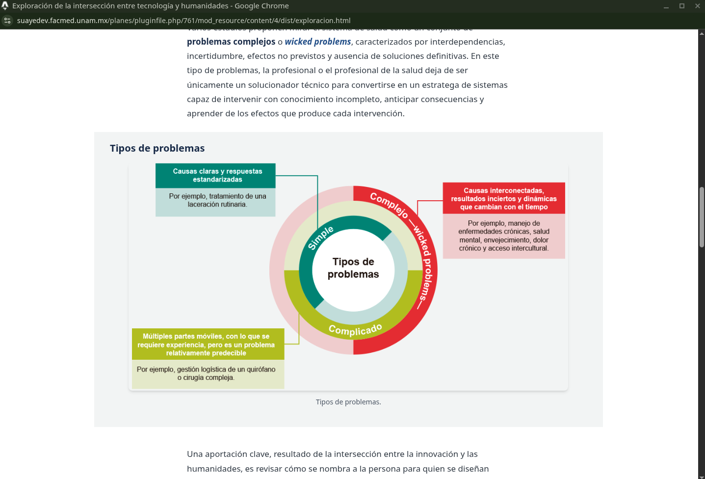

<!-- SALTO-PAGINA -->

### Libros electrónicos FundamentaleSS
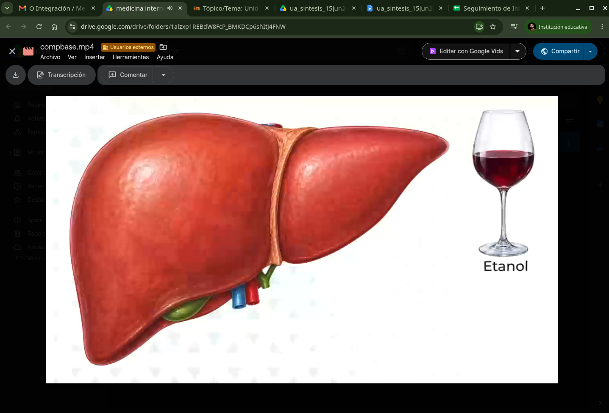
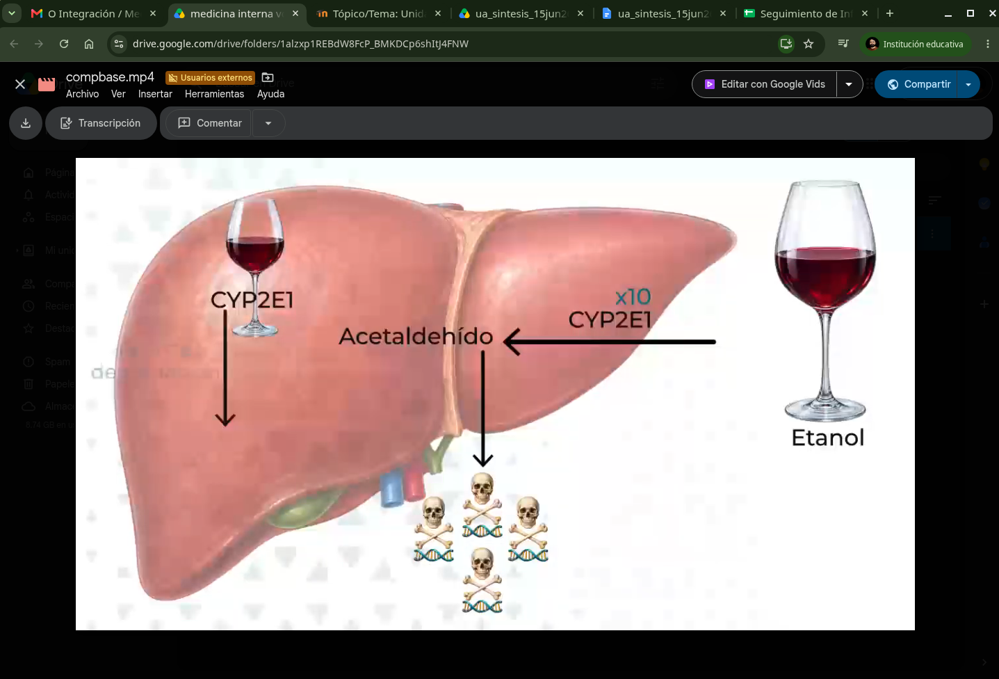
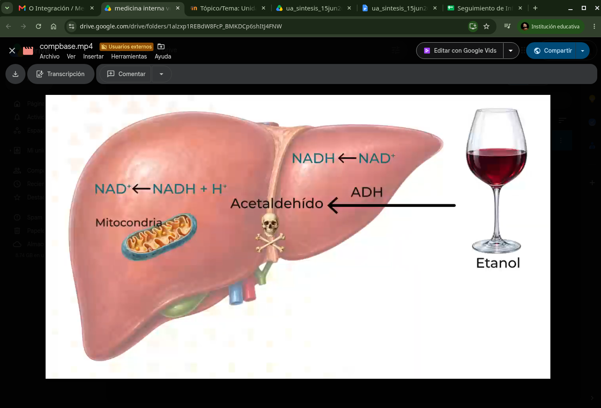
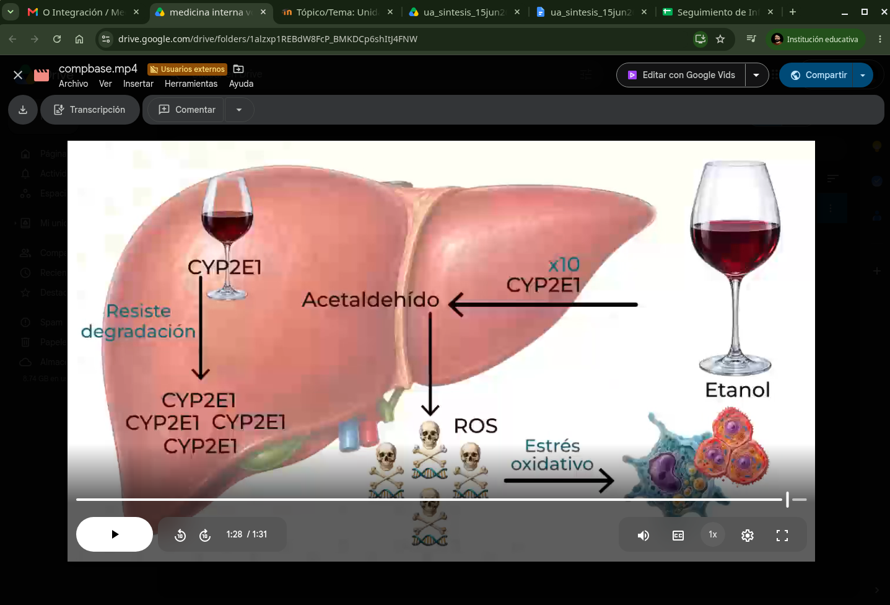
