## Concepto

Integración de recursos web para Unidades de Apoyo para el Aprendizaje, asignaturas optativas y obligatorias a distancia, con base en el presupuesto establecido para este fin en las Bases de Colaboración que se realizan entre la Coordinación de Universidad Abierta y Educación Digital (CUAED) y la Facultad de Medicina del 1 de septiembre al 30 de septiembre de 2026.

## ACTIVIDADES REALIZADAS

### Ponte en line@

Cambios, correcciones y contenido añadido de la UAPA "Eje Hipotálamo-Hipófisis-Órgano Endocrino" adecuación y edición de recursos de plataforma (CUAED) para versiones web de la UAPA.

* Cambio, actualización y adición de contenido HTML en repositorio GitHub (25 cambios).
* Corrección en datos de imágenes embebidos en UAPA. (8 imágenes).
* Ajuste en producción audiovisual.
* Ajuste en hojas de estilo CSS para correcta visualización en dispositivos móviles.

<!-- SALTO-PAGINA -->

Cambios, correcciones y contenido añadido de la UAPA "Osteología", adecuación y edición de recursos de plataforma (CUAED) para versiones web de la UAPA.

* Cambio, actualización y adición de contenido HTML en repositorio GitHub (2 cambios).
* Corrección en datos de imágenes embebidos en UAPA. (1 imagen).
* Ajuste en producción audiovisual.
* Ajuste en hojas de estilo CSS para correcta visualización en dispositivos móviles.

Cambios, correcciones y contenido añadido de la UAPA "Funciones Secretoras del Aparato Digestivo", adecuación y edición de recursos de plataforma (CUAED) para versiones web de la UAPA.

* Cambio, actualización y adición de contenido HTML en repositorio GitHub (7 cambios).
* Corrección en datos de imágenes embebidos en UAPA. (1 imagen).
* Ajuste en producción audiovisual.
* Ajuste en hojas de estilo CSS para correcta visualización en dispositivos móviles.

<!-- SALTO-PAGINA -->

Cambios, correcciones y contenido añadido de la UAPA "La Síntesis como Cuarto Paso del Método Estadístico", adecuación y edición de recursos de plataforma (CUAED) para versiones web de la UAPA.

* Cambio, actualización y adición de contenido HTML en repositorio GitHub (3 cambios).
* Ajuste en producción audiovisual.
* Ajuste en hojas de estilo CSS para correcta visualización en dispositivos móviles.

### Programa de Liderazgo e Innovación Interprofesional en Salud (PLIIS)

Cambios, correcciones y contenido añadido a la unidad de aprendizaje “Innovación y Aplicación de la Tecnología” con la plataforma web que incluye, desarrollo de contenido HTML para plataforma y producción audiovisual.

* Cambio de actividades moodle y adición de contenido HTML. (4 actividades).
* Ajuste en contenido HTML de la unidad de aprendizaje para correcta visualización en dispositivos móviles.
* Corrección de inconsistencias en contenido HTML de la unidad de aprendizaje.
* Corrección en datos de imágenes embebidos en contenido HTML customizado. (1 imagen).
* Ajuste en producción audiovisual.

Cambios, correcciones y contenido añadido a la unidad de aprendizaje “Liderazgo Transformacional en Salud” con la plataforma web que incluye, desarrollo de contenido HTML para plataforma y producción audiovisual.

* Cambio de actividades moodle y adición de contenido HTML. (2 actividades).
* Ajuste en contenido HTML de la unidad de aprendizaje para correcta visualización en dispositivos móviles.
* Corrección en datos de imágenes embebidos en contenido HTML customizado. (1 imagen).
* Ajuste en producción audiovisual.

## PROBATORIOS

### Ponte en line@ - UAPA 1

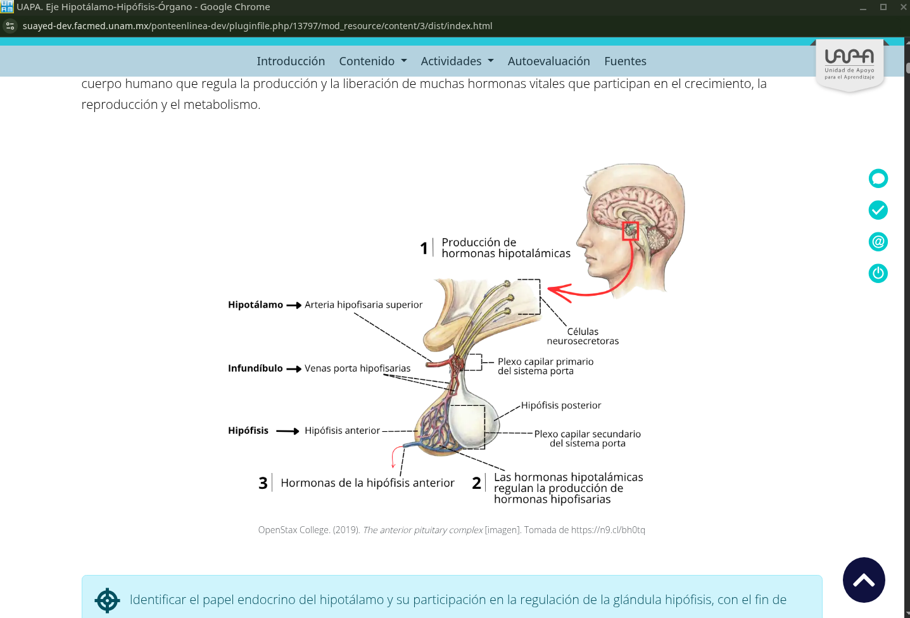
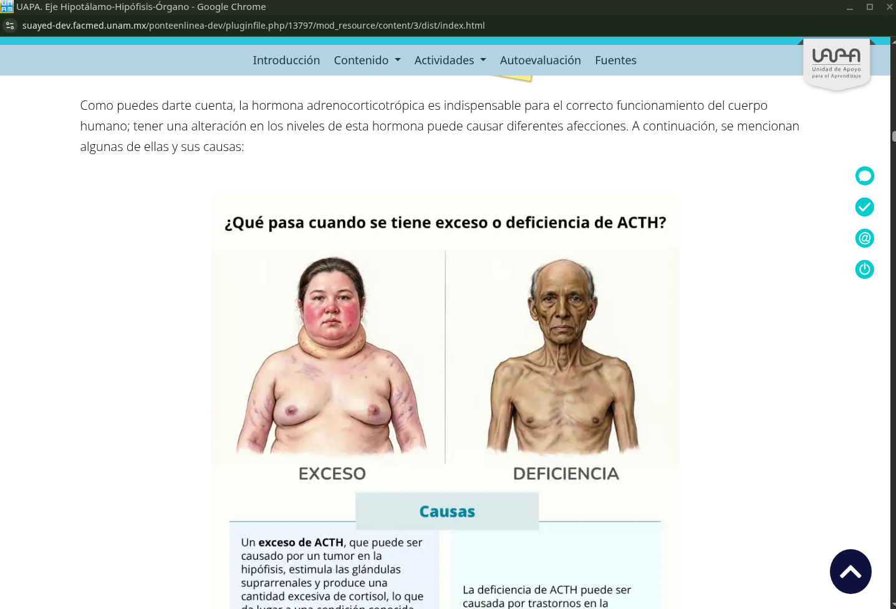
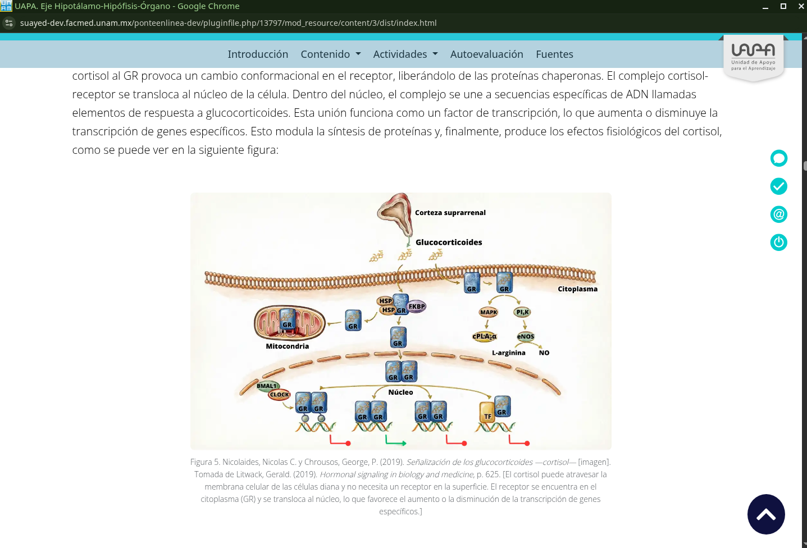

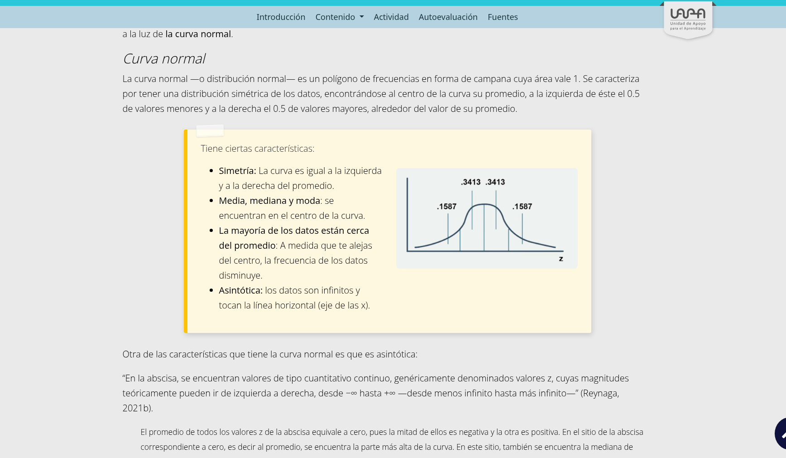

<!-- SALTO-PAGINA -->

### Ponte en line@ - UAPA 2

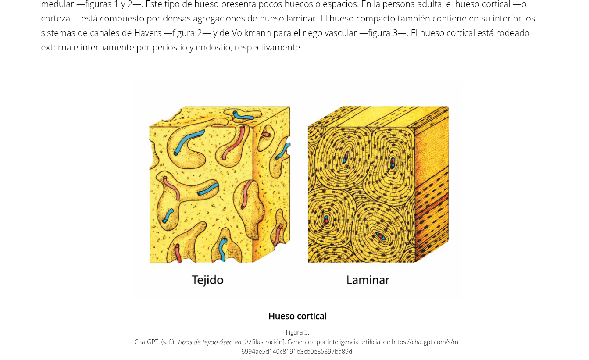

### Programa de Liderazgo e Innovación Interprofesional en Salud

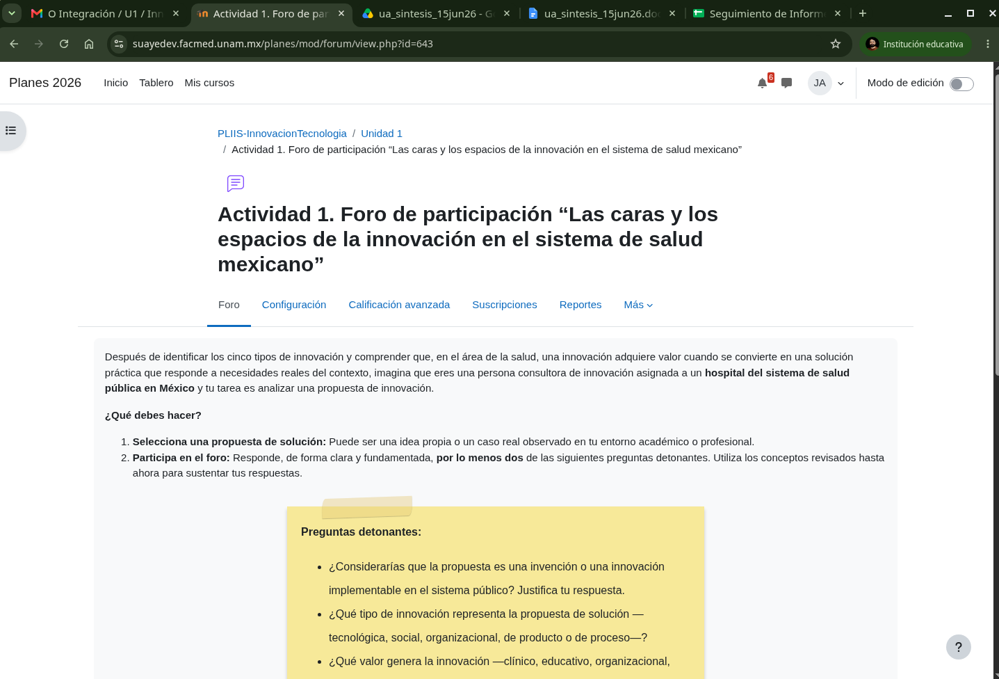
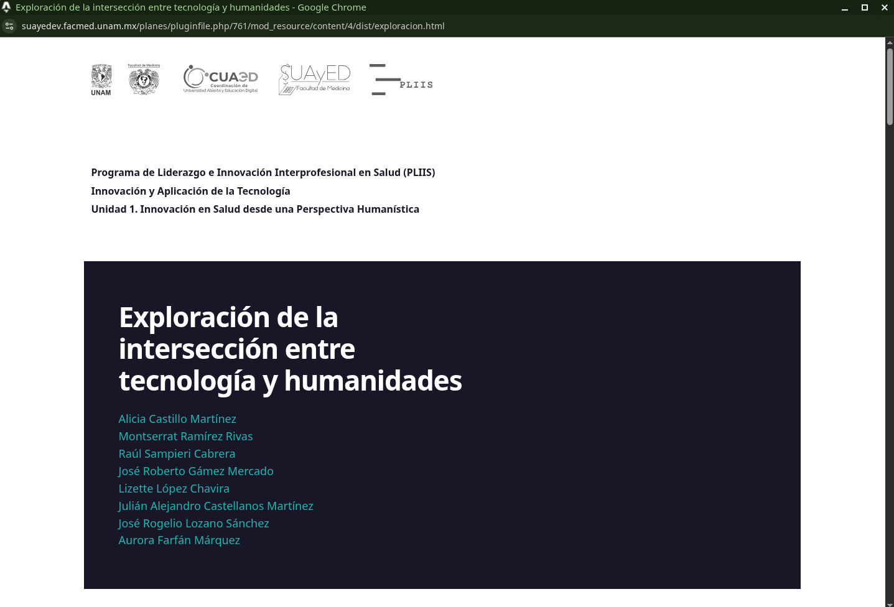

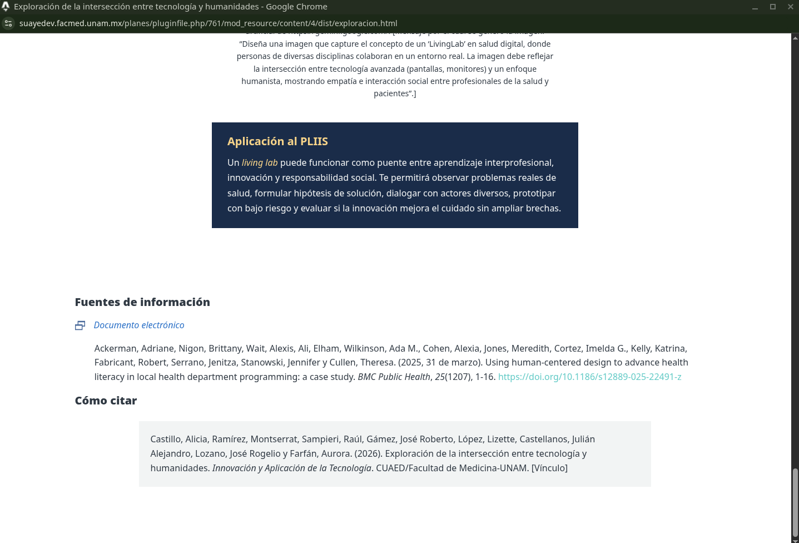
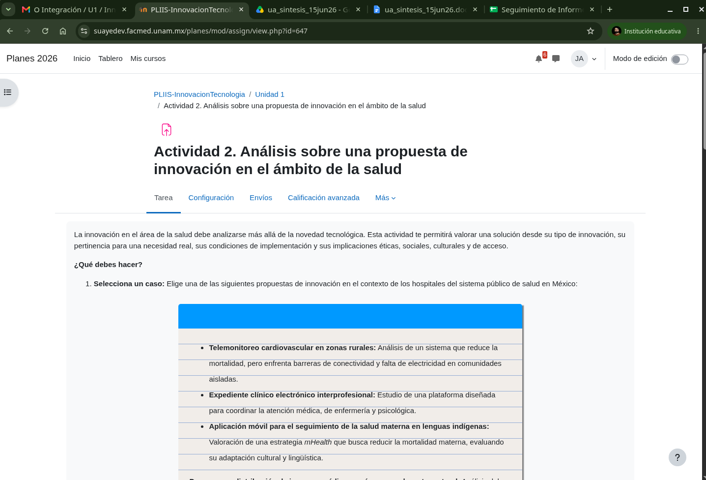
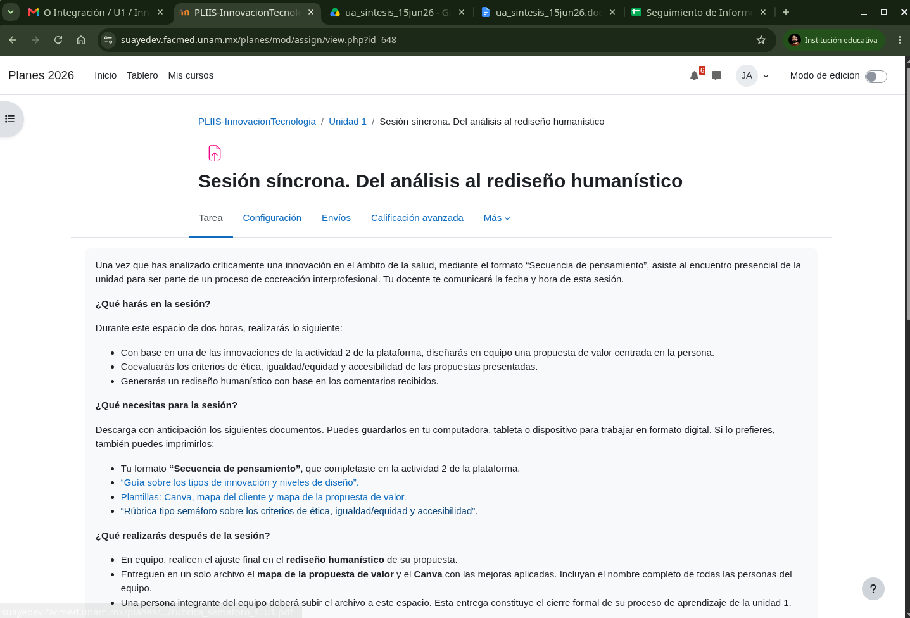
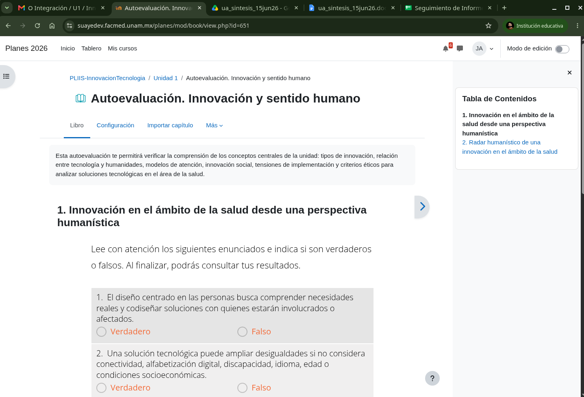
